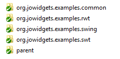

% Jowidgets Nutzerhandbuch
% Michael Grossmann
% 02. Februar 2015

[API_DOC]: <http://www.jowidgets.org/api_doc/index.html>  "Jowidgets API Spezification"


# Einführung

Dieses Nutzerhandbuch bietet eine Einführung in die Verwendung von jowidgets. 

Das Dokument ist sowohl als [PDF Version](documentation.pdf) als auch online unter [http://www.jowidgets.org/docu/](http://www.jowidgets.org/docu/) verfügbar. 

Unter [http://www.jowidgets.org/api_doc/][API_DOC] ist die jowidgets API Spezifikation zu finden. 

## Bachelorarbeiten

Im Rahmen der Jowidgets Entwicklung wurden mehrere Bachelorarbeiten zum Thema angefertigt. Die folgende Liste enthält eine Auswahl:

  * [Erweiterung von Layout-Manager Konzepten für Jo Widgets](ba_nm.pdf)
  * [Entwicklung eines Prototyps einer Test-Bibliothek zum GUI Framework Jo Widgets für automatisierte Tests](ba_nm.pdf)
  * [Evaluierung der Eignung von JavaFX 2 als UI Technologie für das GUI-Framework Jo Widgets anhand einer prototypischen Implementierung des Jo Widgets Service Provider Interfaces](ba_db.pdf)

## Lizenz

Jowidgets steht unter der [BSD Lizenz](https://www.freebsd.org/copyright/freebsd-license.html) und kann somit sowohl für kommerzielle als auch für nicht kommerzielle Zwecke frei verwendet werden.

## Motivation

Jowidgets ist eine API zur Erstellung von graphischen Benutzeroberflächen mit Java.

Der kritische Leser stellt sich nun eventuell die Frage: "_Warum noch ein UI Framework, gibt es da nicht schon genug?_"

Die Erfahrung bei der Entwicklung von graphischen Oberflächen in unterschiedlichen Unternehmen hat gezeigt, das für viele in Unternehmen typischen Anwendungsfälle oft keine Lösungen in Standard UI Frameworks existieren, und aus dieser Not heraus das _Rad_ für diese immer wieder _neu erfunden_ wird. 

Hierzu ein kleines Beispiel. In einer Eingabemaske soll in ein Eingabefeld eine Zahl eingegeben werden. Die Eingabe soll validiert werden, und der Nutzer soll ein möglichst für ihn verständliches Feedback bekommen, wenn etwas falsch ist. Für die Eingabe bietet Swing ein `JTextField`. Dieses liefert aber einen String und keine Zahl zurück, das heißt der Wert muss erst konvertiert werden. Für die Anzeige des Validierungsfeedback könnte man in Swing ein `JLabel` verwenden. Da man Anwendungsfälle wie die Eingabe von Zahlen, Eingabe eines Datum, Anzeige von Validierungsfehlern, etc. in sehr vielen Softwarehäusern vorfindet, existieren vermutlich auch in jeder dieser firmeninternen UI Bibliothek Widgets wie: `InputNumberField`, `ValidatedInputNumberField`, `ValidatedDateField`, `ValidationLabel` usw.. Wer sich hier _wieder findet_ oder wer vielleicht selbst schon mal solch ein Widget implementiert oder verwendet hat, für den könnte jowidgets möglicherweise genau _das richtige_ UI Framework sein. 

Im Vergleich zu herkömmlichen Technologien wie _Swing_, oder _JavaFx_ liefert jowidgets kein eigenständiges Rendering für Basiswidgets ^[Wie zum Beispiel Frame, Dialog, Composite, Button, TextField, ...], sondern lediglich Adapter, welche die jowidgets Widget Schnittstellen implementieren. Dadurch ist es möglich, UI Code, welcher gegen das jowidgets API implementiert wurde, mit quasi jedem Java UI Framework auszuführen. Derzeit existieren Adapter (SPI Implementierungen, siehe  [Architektur](#architecture)) für [Swing](http://www.java-tutorial.org/swing.html), [SWT](http://eclipse.org/swt/) und [RWT](http://eclipse.org/rap/). Dadurch ist es sogar möglich, eine jowidgets Applikation als [Webapplikation](#jowidgets_rap) im Browser auszuführen. Eine _JavaFx_ Adapter Implementierung wurde im Rahmen einer [Bachelorarbeit](ba_db.pdf) prototypisch umgesetzt. Es existieren Bundle Manifeste für OSGi, so dass auch ein Einsatz in [Eclipse RCP](https://eclipse.org/) (siehe [Jowidgets und RCP](#jowidgets_rcp)) ohne weiters möglich ist.

Aufbauend auf den Basiswidgets existieren wie bereits weiter oben angedeutet zusätzliche Composite Widgets und Features, welche sich in herkömmlichen UI-Frameworks nicht finden. Zwei davon sollen an dieser Stelle exemplarisch vorgestellt werden.  

Beispielsweise gibt es ein generisches [`InputField<VALUE_TYPE>`](#input_field). Dieses hat Methoden wie `VALUE_TYPE getValue()` oder `setValue(VALUE_TYPE value)`. Für Standarddatentypen wie `Integer`, `Long`, `Double`, `Float`, `Date`, etc. existieren bereits Defaultimplementierungen. Im obigen Beispiel würde das Eingabefeld also bereits eine Zahl liefern. Mit Hilfe von Convertern kann aber auch jeder beliebige andere Datentyp unterstützt werden. Für ein `InputField` lassen sich auch beliebige Validatoren definieren. Zudem kann die UI an [`ObservableValues`](#observable_values) gebunden werden. 

Für das nächste Feature betrachten wir noch einmal das vorige Beispiel mit dem Eingabefeld von Zahlen. Für die Validierungsausgabe könnte ein ValidationLabel Widget erstellt worden sein, welches Warnungen und Fehler mit entsprechenden Icons und / oder Fehlertext anzeigen kann. Dabei kann man sowohl die Icons als auch die Farbe konfigurieren, weil Kunde A Fehler nur mit _dezenten_ Farben angzeigt bekommen möchte (laut Aussage seiner Mitarbeiter bekommt man von der standardmäßig verwendeten Farbe _Augenkrämpfe_), Kunde B kann aber Validierungsfehler, die nicht _fett_ und _rot_ angezeigt werden, gar nicht wahrnehmen, was die Applikation für ihn unbrauchbar macht. Stellen wir uns nun weiter vor, diese Eingabefelder und Validierungslabels sind in ein Widget mit dem Namen `GenericInputForm` eingebettet, welches sowohl von Kunde A als auch von Kunde B verwendet wird, und stellen wir uns weiter vor, dass die verwendeten Widgets noch weitere Konfigurationsattribute haben, dann müssten diese alle auch für das `GenericInputForm` konfigurierbar sein. Spätestens wenn dieses in ein weiteres Modul eingebettet ist, wird klar, dass dieses Vorgehen schnell unpraktikabel wird. 

In jowidgets ist es u.A. für solche Anwendungsfälle möglich, für jedes beliebige Widget die Defaulteinstellungen global _umzudefinieren_ (siehe dazu [Widget Defaults](#widget_defaults)). So könnte man im genannten Beispiel die gleiche Applikation einmal mit _roten_ und einmal mit _grauen_ Validierungslabels ausliefern, ohne dazu die eigentliche Applikation anpassen zu müssen. Mit der gleichen Methode könnte man zum Beispiel auch die Reihenfolge für Buttons in Eingabedialogen anpassen, definieren in welchem Format Datumswerte angezeigt werden sollen, definieren ob Buttons für Speichern und Abbrechen auf jedem Formular oder nur in der Toolbar vorhanden sind, uvm..


## Architektur {#architecture}

Die folgende Abbildung zeigt die jowidgets Architektur.


UI Code wird gegen das Widget API implementiert. Die Default Implementierung von jowidgets verwendet das Widget SPI ^[Service Provider Interface], um die Features der API zu implementieren. Für die SPI existieren derzeit Implementierungen für [Swing](http://www.java-tutorial.org/swing.html), [SWT](http://eclipse.org/swt/) und [RWT](http://eclipse.org/rap/). Die SPI Implementierungen enthalten Adapter, welche die SPI Widget Schnittstellen implementieren. 

Die Schnittstellen der SPI Widgets wurden bewusst _schlank_ gehalten, um das Hinzufügen einer neuen UI Technologie möglichst einfach zu gestalten, ohne dabei Abstriche bei der _Mächtigkeit_ der API machen zu müssen. 

Dies soll am Vergleich mit dem Eclipse Standard Widget Toolkit (SWT) erläutert werden. Dort findet man eine ähnliche Architekur. Es gibt eine API, welche für verschiedenen Platformen implementiert ist. Die Implementierungen stellen im Prinzip Adapter bereit, welche mittels JNI Methodenaufrufe an das jeweilige native UI Toolkit delegieren.  

Wer SWT kennt, weiß jedoch, dass sich die Verwendung der API zum Teil sehr _low level anfühlt_. Will man hingegen eine API Implementierung machen (zum Bespiel für Swing oder JavaFX), sieht aus dieser Perspektive betrachtet die API sehr _mächtig_ und komplex aus. Bei der Definition der Schnittstellen musste immer ein Kompromiss aus einfacher Implementierbarkeit und komfortabler Nutzbarkeit gemacht werden. 

Durch die Aufteilung in API und SPI kann die API _mächtige_ Funktionen enthalten, welche aber nur ein mal implementiert werden müssen. Auf der anderen Seite ist eine SPI Implementierung für eine neue UI Technologie keine allzu komplexes Aufgabe, was die Option bietet, geschrieben UI Code auch für zukünftige UI Technologien wiederzuverwenden.

Im diesem Kontext liegt vielleicht der Vergleich nahe, die jowidgets SPI mit SWT zu vergleichen, und die jowidgets API mit [JFace](https://wiki.eclipse.org/JFace). Dieser Vergleich ist jedoch nicht ganz korrekt, denn:

* Die jowidgets SPI muss man nicht direkt verwenden, sondern man verwendet die _high level_ Schnittstellen der API. Es gibt jedoch nicht für alle SWT Wigdets ein JFace _Pondon_. 

* Die jowidgets API bietet Funktionen, welche JFace nicht bietet. JFace bietet allerdings auch Funktionen, welche jowidgets _noch_ nicht bietet.

* Jowidgets kann auch mit Swing oder zukünftigen Ui Technologien verwendet werden. Es gibt für SWT zwar auch eine [Swing Implementierung](http://swtswing.sourceforge.net/main/index.html), diese ist aber nicht vollständig und wird seit 2007 nicht mehr gepflegt. Für zukünftige UI Technologien ist eine jowidgets SPI Implementierung weniger aufwändig als eine SWT Implementierung. Code der gegen das jowidgets API implementiert wurde, ist dadurch in gewisser Hinsicht robust gegen technologische Neuerungen. 


## Widget Paradigma

In diesem Abschnitt soll der Begriff des _Widget_ im Kontext von jowidgets definiert werden. Dazu wird zunächst ein kleiner Abstecher zur Entstehungsgeschichte gemacht.

In einem gemeinsamen Projekt zweier Unternehmen sollte ein bereits vorhandenes firmeninternes Framework neu entwickelt werden. Dieses Framework lieferte unter anderem Tabellen und Formulare für CRUD Anwendungen mit Datenbankanbindung sowie Sortierung und Filterung in der Datenbank (und nicht im Client, weil das für große Datenmengen nicht möglich ist). Bei der Neuentwicklung sollten bisherige Schwachpunkte wie eine fehlende 3 Tier Architektur, keine Security in der Service Schicht und eine nicht austauschbare Datenschicht optimiert werden. ^[Dieses Framework ist auch unter BSD Lizenz veröffentlicht und findet sich hier [jo-client-platform](http://code.google.com/p/jo-client-platform/)]

Die eine Firma setzte Eclipse RCP ein und wollte daran auch nichts ändern, die andere Swing. Die neu entwickelten Module sollten aber auch für die Erweiterung bisheriger (Swing) Applikation _kompatibel_ sein und ob man zukünftig anstatt Swing SWT einsetzten wollte, war auch nicht geklärt.

So entstand die Idee, für die UI relevanten Anteile wie die `BeanTable` und das `BeanForm` Schnittstellen zu definieren. Die eine Firma implementierte dann das dazugehörige Widget für Swing, die andere für SWT. Schnell wurde klar, das diese Aufteilung zu _grob_ war, denn es entstand hauptsächlich für das Formular viel redundanter Code. Es wuchs die Begehrlichkeit, auch für Eingabefelder, Comboboxen, etc. Schnittstellen zu definieren, um das `BeanForm` auf Basis dieser implementieren zu können. Das war die _Geburtsstunde_ von jowidgets. 

Man kam zu dem Schluss, dass jede Interaktion mit dem Nutzer (HCI) durch eine Java Schnittstelle spezifiziert werden kann und soll. Dies gilt für einfache Controls wie ein `Button`, eine `ComboBox` oder ein `Eingabefeld` genauso wie für zusammengesetzte Widgets wie Beispielsweise ein Formular oder ein Dialog zur Eingabe einer Person. Während das einfache Control vielleicht eine Zahl oder einen Text liefert, liefert ein `BeanForm` ein Bean und ein `PersonDialog` ein Personenobjekt.

Das API sollte nicht nur diese einfachen und zusammengesetzten Widgets Schnittstellen bereitstellen, sondern auch eine Platform bieten um selbst eigene Widget Bibliotheken nach dem gleichen Konzept und mit dem gleichen Benefit wie anpassbaren Defaultwerten, Dekorierbarkeit, Testbarkeit, etc. zu erstellen. 

Jowidgets sollte eine __offene__, __erweiterbare__ API für Widgets in Java bieten. Der Name jowidges steht ursprünglich für _Java Open Widgets_.

>>>_Defintion: 
>>>Ein Widget ist eine Schnittstelle für den Austausch von Informationen zwischen Nutzer und Applikation_

In jowidgets werden diese Schnittstellen immer durch Java Interfaces abgebildet. Es kann generell mehrere Implementierungen für die gleiche Schnittstelle geben. So könnte zum Beispiel die Eingabe von Personendaten auf einem Tablet anders aussehen als auf einem Desktop PC. Eine Widget Implementierung kann in der WidgetFactory überschrieben oder dekoriert (Decorator Pattern) werden. Zudem läßt sich das Default Setup eines jeden Widgets überschreiben.


## Widget Hierarchie{#widget_hierarchy}

Folgende Abbildungen zeigt die konzeptionelle (nicht vollständige) Widget Hierarchie von jowidgets. Widgets teilen sich auf oberster Ebene in Komponenten (Component) und Items mit Menüs auf.


Komponenten sind Fenster, Controls, Container oder InputComponents. Container enthalten Controls bzw. Controls sind Elemente von Containern. InputComponents liefern eine Nutzereingabe für einen definierten Datentyp und stellen diesen Wert dar. Dieser kann sowohl einfach sein (z.B. `String`, `Integer`,`Date`, ...) als auch komplex (z.B. `Person`, `Company`, `Rule`, ...). 


Items sind die Elemente von Menüs oder Toolbars. Eine MenuBar enthält Menüs.


# Getting started

## Maven

Für die Verwendung von jowidgets mit Maven muss folgendes Repository hinzugefügt werden:

~~~ {.xml}
<repositories>
    <!-- The jowidgets maven repository -->
    <repository>
        <id>jowidgets</id>
        <url>http://jowidgets.org/maven2/</url>
    </repository>
</repositories>
~~~

## Das Hello World Beispiel{#hello_world_example}

Das Hello World Beispiel soll als Einstieg in jowidgets dienen. Dabei wird bewußt etwas mehr in die Tiefe gegangen, als nötig wäre, um ein Fenster mit einem Button in jowidgets anzuzeigen. Das Beispiel kann gut als Grundlage für die weitere Arbeit dienen. Daher wird empfohlen, es auszuchecken oder nachzuimplementieren. 

Um das Hello World Beispiel zu compilieren und zu starten sollten folgende Tools vorhanden sein:

* Java (mindestens 1.6)
* Maven
* SVN
* Eclipse (inklusive M2e Maven Integration)
* Tomcat (für das Starten im Browser)

Das Hello World Beispiel kann hier [http://jo-widgets.googlecode.com/svn/trunk/modules/helloworld](http://jo-widgets.googlecode.com/svn/trunk/modules/helloworld) per SVN ausgecheckt werden. 

Es findet sich dann die folgende Verzeichnisstruktur:



Die Module können mit __Import Existing Maven Projects__ in eclipse importiert werden. 

### Das parent Modul

Im _parent_ Verzeichnis findet sich das parent pom.xml. 

~~~ {.xml .numberLines startFrom="1"}
<project 
	xmlns="http://maven.apache.org/POM/4.0.0" 
	xmlns:xsi="http://www.w3.org/2001/XMLSchema-instance" 
	xsi:schemaLocation="http://maven.apache.org/POM/4.0.0 
	http://maven.apache.org/xsd/maven-4.0.0.xsd">
	
	<modelVersion>4.0.0</modelVersion>
	
	<groupId>org.jowidgets.helloworld</groupId>
	<artifactId>org.jowidgets.helloworld.parent</artifactId>
	<version>0.0.1-SNAPSHOT</version>
	<packaging>pom</packaging>

	<properties>
		<!-- jowidgets needs java 1.6 or higher -->
		<java.version>1.6</java.version>
		<project.build.sourceEncoding>UTF-8</project.build.sourceEncoding>
		<jowidgets.version>0.40.0</jowidgets.version>
	</properties>
	
	<repositories>
	    <!-- The jowidgets maven repository -->
		<repository>
			<id>jowidgets</id>
			<url>http://jowidgets.org/maven2/</url>
		</repository>
	</repositories>
	
	<modules>
		<!-- Hold the ui technology independend hello world code -->
		<module>../org.jowidgets.helloworld.common</module>
		
		<!-- Holds a starter that uses Java Swing -->
		<module>../org.jowidgets.helloworld.starter.swing</module>
		
		<!-- Holds a starter that uses Eclipse SWT (win32) -->
		<module>../org.jowidgets.helloworld.starter.swt</module>
		
		<!-- This module creates a war that uses Eclipse RWT -->
		<module>../org.jowidgets.helloworld.starter.rwt</module>
	</modules>
	
	...

</project>
~~~

Die Hello World Applikation besteht aus vier Untermodulen.

* org.jowidgets.helloworld.common
* org.jowidgets.helloworld.starter.swing
* org.jowidgets.helloworld.starter.swt
* org.jowidgets.helloworld.starter.rwt

Das Modul `org.jowidgets.helloworld.common` enthält den SPI unabhängigen Code, die drei anderen Module beinhalten die Starter für die jeweilige SPI Implementierung sowie die zugehörigen Maven Abhängigkeiten. 

In einem _realen_ Projekt hat man normalerweise nicht Starter für alle möglichen SPI Implementierungen. Dennoch ist es eine gute Idee, den SPI unabhängigen Code in ein separates Modul zu packen, um ihn in anderen Projekten, welche eventuell eine andere UI Technologie voraussetzen, besser wiederverwenden zu können.

### Das common Modul

Betrachten wir zunächst das _common_ pom.xml File im Ordner `org.jowidgets.helloworld.common`. Will man die Kernfunktion von jowidgets nutzen, muss man das Modul `org.jowidgets.tools` hinzufügen.

~~~ {.xml .numberLines startFrom="1"}
<project 
	xmlns="http://maven.apache.org/POM/4.0.0" 
	xmlns:xsi="http://www.w3.org/2001/XMLSchema-instance"
	xsi:schemaLocation="http://maven.apache.org/POM/4.0.0 
	http://maven.apache.org/xsd/maven-4.0.0.xsd">
	
	<modelVersion>4.0.0</modelVersion>
	<artifactId>org.jowidgets.helloworld.common</artifactId>

	<parent>
		<groupId>org.jowidgets.helloworld</groupId>
		<artifactId>org.jowidgets.helloworld.parent</artifactId>
		<version>0.0.1-SNAPSHOT</version>
		<relativePath>../parent/pom.xml</relativePath>
	</parent>
	
	<dependencies>	
		<!-- The jowidgets api and tools -->
		<dependency>
			<groupId>org.jowidgets</groupId>
			<artifactId>org.jowidgets.tools</artifactId>
			<version>${jowidgets.version}</version>
		</dependency>
	</dependencies>

</project>
~~~

### Transitive Abhängigkeiten des common Moduls

In der Praxis ist immer gut zu wissen, welche transitiven Abhängigkeiten man sich _einhandelt_, wenn man eine neue Technologie einführt. Jowidgets wurde bewusst so entworfen, dass (außer jowidgets selbst) __möglichst keine weiteren externen Abhängigkeiten__ notwendig sind. 

Durch das Modul __`org.jowidgets.tools`__ hat man die folgenden internen (siehe auch [Jowidgets Modulübersicht](#module_overview) im Anhang) und __keine externen transitiven Abhängigkeiten__.

__org.jowidgets.util__

:   UI unabhängige Utilities und Datenstrukturen. Siehe auch [Jowidgets Utils](#jowidgets_utils).

__org.jowidgets.i18n__

:   Eine API für (Multi User Locale) Internationalisierung. Siehe auch [i18n](#jowidgets_i18n).

__org.jowidgets.classloading.api__

:   API für Classloading Aspekte. Dies ist hauptsächlich für die OSGi Kompatibilität notwendig. Siehe auch [Jowidgets Classloading](#jowidgets_classloading).

__org.jowidgets.validation__

:   Eine (UI unabhängige) API für Validierung.

__org.jowidgets.validation.tools__

:   Vorgefertigte Validatoren.

__org.jowidgets.unit__

:   Eine (UI unabhängige) API für den Umgang mit Einheiten (z.B. Hz, Byte, KG, etc.).

__org.jowidgets.common__

:   Gemeinsame Schnittstellen und Klassen der jowidgets API und der jowidgets SPI.

__org.jowidgets.api__

:   Die jowidgets API (überwiegend Java Interfaces).

__org.jowidgets.tools__

:   Während die API überwiegend aus Schnittstellen besteht, finden sich hier nützliche Klassen, welche sich aus den Schnittstellen ergeben, wie zum Beispiel Default Implementierungen, abstrakte Basisklassen, Wrapper, Listener Adapter und weitere. 


### HelloWorldApplication - Der common Ui Code{#hello_world_common_code}

Die Klasse `HelloWorldApplication` implementiert die Schnittstelle `IApplication`. Diese hat eine Startmethode, welche den `Lifecycle` als Parameter liefert. Wird auf diesem die Methode `finish()`aufgerufen, wird die Applikation beendet. 

Will man jowidgets in nativen Ui Code (z.B. Swing oder SWT) integrieren, hat man in der Regel keine IApplication zum starten. Stattdessen werden das Root Fenster  (z.B. Shell oder JFrame) und weitere Widgets (z.B. Composite, JPanel) nativ erzeugt. In [Jowidgets Code in native Projekte integrieren](#integrate_jowidgets_in_native_code) wird erläutert, wie man in diesem Fall vorgehen kann.

```{.java .numberLines startFrom="1"} 
package org.jowidgets.helloworld.common;

import org.jowidgets.api.toolkit.Toolkit;
import org.jowidgets.api.widgets.IButton;
import org.jowidgets.api.widgets.IFrame;
import org.jowidgets.api.widgets.blueprint.IButtonBluePrint;
import org.jowidgets.api.widgets.blueprint.IFrameBluePrint;
import org.jowidgets.common.application.IApplication;
import org.jowidgets.common.application.IApplicationLifecycle;
import org.jowidgets.common.types.Dimension;
import org.jowidgets.common.widgets.controller.IActionListener;
import org.jowidgets.common.widgets.layout.MigLayoutDescriptor;
import org.jowidgets.tools.widgets.blueprint.BPF;

public final class HelloWorldApplication implements IApplication {

	@Override
	public void start(final IApplicationLifecycle lifecycle) {

		//Create a frame BluePrint with help of the BluePrintFactory (BPF)
		final IFrameBluePrint frameBp = BPF.frame();
		frameBp.setSize(new Dimension(400, 300)).setTitle("Hello World");

		//Create a frame with help of the Toolkit and BluePrint. 
		//This convenience method finishes the ApplicationLifecycle when 
		//the root frame will be closed.
		final IFrame frame = Toolkit.createRootFrame(frameBp, lifecycle);

		//Use a simple MigLayout with one column and one row 
		frame.setLayout(new MigLayoutDescriptor("[]", "[]"));

		//Create a button BluePrint with help of the BluePrintFactory (BPF)
		final IButtonBluePrint buttonBp = BPF.button().setText("Hello World");

		//Add the button defined by the BluePrint to the frame
		final IButton button = frame.add(buttonBp);

		//Add an ActionListener to the button
		button.addActionListener(new IActionListener() {
			@Override
			public void actionPerformed() {
				System.out.println("Hello World");
			}
		});

		//set the root frame visible
		frame.setVisible(true);
	}
}
```

Im Vergleich zu anderern UI Frameworks gibt es in jowidgets einen wesentlichen Unterschied bei der Widget Erzeugung. Widgets werden nicht direkt, also mit Hilfe des `new` Schlüßelwortes instantiiert, sondern von einer Factory erzeugt. Dies hat einige Vorteile, siehe dazu auch [Die GenericWidgetFactory](#generic_widget_factory). 

Die Wigdet Factory benötigt für die Erzeugung eines Widgets ein sogenanntes _BluePrint_ (Blaupause). Siehe dazu auch [BluePrints](#blue_prints). BluePrints erhält man von der BluePrintFactory. Die Klasse `BPF` liefert einen Zugriffspunkt auf alle BluePrints der BluePrintFactory. In Zeile 21 wird so das BluePrint für ein Frame und in Zeile 33 das BluePrint für einen Button erzeugt. BluePrints sind Setup und Builder zugleich. Sie werden dazu verwendet, das Widgets zu Konfigurieren und liefern dadurch der Implementierung das initiale Setup des Widgets. In Zeile 22 wird so die Größe und der Titel des Fensters gesetzt. In Zeile 33 wird so das Button Label definiert. BluePrints sind nach dem Prinzip des _BuilderPattern_ entworfen, das heißt sie liefern die eigene Instanz als Rückgabewert, um verkettete Aufrufe zu ermöglichen.

In der Regel wird die Widget Factory nicht explizit verwendet. Um das root Fenster zu erhalten, wird in Zeile 27 ein IFrame Widget mit Hilfe des `frameBp` und des Toolkit's erzeugt. Bei der verwendeten Methode handelt es sich um eine _convenience Methode_ die beim Schließen des Fensters den `ApplicationLifecycle` beendet. Das Frame ist gleichzeitig auch ein Container. Um ein Widget zu einem Container hinzuzufügen, fügt man das BluePrint hinzu und erhält dafür das Widget. In Zeile 36 wird so der Button erzeugt. 

In Zeile 30 wird das [Layout](#layouting) mit einer Spalte und einer Zeile für das Frame gesetzt. Zeile 39 fügt dem erzeugten Button einen Listener hinzu, welcher beim _Klicken_ eine Konsolenausgabe macht. In Zeile 47 wird das Fenster schlußendlich angezeigt.

__Fassen wir noch einmal zusammen:__

:     Um Widgets zu erhalten, benötigt man vorab ein BluePrint. Dieses erhält man von der BluePrint Factory. Auf dem BluePrint kann man das Setup konfigurieren. Für ein BluePrint bekommt man dann ein Widget.

Auch wenn sich das vielleicht erst mal ungewohnt anhört, ist das auch schon alles, was im Vergleich zu anderen UI Frameworks generell anders ist.

Man wird zudem schnell feststellen, dass man dadurch sehr kompakten und zudem gut lesbaren UI Code erzeugen kann. Den im Vergleich zu langen Konstruktoraufrufen ist beim Builder Pattern immer klar, welchen Parameter man konfiguriert. Außerdem kann die Erzeugung von BluePrints meist auch implizit passieren. So könnte man den Code von Zeile 32 bis 36 auch so aufschreiben:

```{.java} 
	final IButton button = frame.add(BPF.button().setText("Hello World"));
```

Zudem können BluePrints für die Erzeugung mehrerer Instanzen wiederverwendet werden, was sich oft als sehr hilfreich erweißt.

__Anbei folgen noch ein paar Anmerkungen zum Code Style:__

Unter dem Begriff [CleanCode](#http://de.wikipedia.org/wiki/Clean_Code) findet sich der Hinweis, immer _sprechende_ Variablennamen zu verwenden, und insbesondere kryptische Variablennamen wie: "is, os, hfu, jkl, ..." etc. zu vermeiden. Im Allgemeinen ist dem auch voll zuzustimmen. 

Da jedoch BluePrints in jowidgets eine so fundamentale Rolle spielen, wird hier dennoch bewusst von dieser Regel abgewichen. Der Name der _Abbreviation_ Accessor Klasse `BPF` wurde bewußt kurz gewählt, um eine bessere _inline_ Verwendung (siehe oben) zu ermöglichen. (Wer das trotzdem nicht mag, kann anstatt `BPF.button()` auch `Toolkit.getBluePrintFactory().button()` schreiben.)

Um BluePrint Variablen besser von den eigentlichen Widget Variablen unterscheiden zu können, sollten diese per Konvention immer die Endung `bp` oder `bluePrint` haben. Wird das BluePrint nur für die Erzeugung eines einzelnen Widgets verwendet, bietet es sich an, für BluePrint und Widget den gleichen Präfix zu wählen, also zum Beispiel `buttonBp` und `button`. 

### Der Swing Starter {#hello_world_swing}

Um die Applikation mit Swing zu starten, betrachten wir das Modul `org.jowidgets.helloworld.starter.swing` und dort zunächst das folgende pom.xml.

~~~{.xml .numberLines startFrom="1"}
<project 
	xmlns="http://maven.apache.org/POM/4.0.0" 
	xmlns:xsi="http://www.w3.org/2001/XMLSchema-instance"
	xsi:schemaLocation="http://maven.apache.org/POM/4.0.0 
	http://maven.apache.org/xsd/maven-4.0.0.xsd">
	<modelVersion>4.0.0</modelVersion>

	<artifactId>org.jowidgets.helloworld.starter.swing</artifactId>

	<parent>
		<groupId>org.jowidgets.helloworld</groupId>
		<artifactId>org.jowidgets.helloworld.parent</artifactId>
		<version>0.0.1-SNAPSHOT</version>
		<relativePath>../parent/pom.xml</relativePath>
	</parent>
	
	<dependencies>

        <!-- The ui technology independend hello world module -->
		<dependency>
			<groupId>org.jowidgets.helloworld</groupId>
			<artifactId>org.jowidgets.helloworld.common</artifactId>
			<version>0.0.1-SNAPSHOT</version>
		</dependency>

        <!-- The default implementation of the jowidgets api -->
		<dependency>
			<groupId>org.jowidgets</groupId>
			<artifactId>org.jowidgets.impl</artifactId>
			<version>${jowidgets.version}</version>
		</dependency>

        <!-- The Swing implementation of the jowidgets spi -->
		<dependency>
			<groupId>org.jowidgets</groupId>
			<artifactId>org.jowidgets.spi.impl.swing</artifactId>
			<version>${jowidgets.version}</version>
		</dependency>

	</dependencies>

</project>
~~~

Ab Zeile 20 wird das common Modul der HelloWorld Applikation hinzugefügt. Ab Zeile 27 folgt die Defaultimplementierung der jowidgtes API und ab Zeile 34 wird die SPI Implementierung für Swing hinzugefügt.

Dadurch ergeben sich die folgenden (jowidgets internen) transienten Modulabhängigkeiten: 

__org.jowidgets.test.common, org.jowidgets.test.spi, org.jowidgets.test.api__

:   Fügt den Widgets spezielle Testmethoden hinzu, wie zum Beispiel die Methode `push()` für einen Button. Dadurch können etwa in automatisierten JUnit GUI Tests Nutzereingaben simuliert werden. Siehe auch [Automatisierte GUI Tests](#automated_ui_tests). 

__org.jowidgets.spi.impl.common__

:   Gemeinsamer Code der von allen SPI Implementierungen genutzt wird.

__org.jowidgets.spi.impl.swing.common__

:   Die Swing SPI Implementierung.

__org.jowidgets.spi.impl.swing__

:   Die Swing SPI Implementierung als [ServiceLoader](http://docs.oracle.com/javase/6/docs/api/java/util/ServiceLoader.html) Plugin


Die Swing SPI Implementierung hat zudem eine __externe Abhängigkeit auf [MigLayout](http://www.miglayout.com/) für Swing__.


Die Klasse `HelloWorldStarterSwing` ist für das Starten der Applikation zuständig.

~~~{.java .numberLines startFrom="1"} 
package org.jowidgets.helloworld.starter.swing;

import javax.swing.UIManager;

import org.jowidgets.api.toolkit.Toolkit;
import org.jowidgets.helloworld.common.HelloWorldApplication;

public final class HelloWorldStarterSwing {

	private HelloWorldStarterSwing() {}

	public static void main(final String[] args) throws Exception {
		UIManager.setLookAndFeel(UIManager.getSystemLookAndFeelClassName());
		System.setProperty("apple.laf.useScreenMenuBar", "true");
		Toolkit.getApplicationRunner().run(new HelloWorldApplication());
		System.exit(0);
	}
}
~~~

In Zeile 13 wird das System System Look and Feel für Swing gesetzt, Zeile 14 enthält eine iOS spezifische Property um Menüs _Apple typisch_ anzuzeigen. Um die `HelloWorldApplication`, welche `IApplication` implementiert, zu starten, wird ein IApplicationRunner benötigt. Dieser kann vom [Jowidgets Toolkit](#jowidgets_toolkit) geholt werden. In Zeile 15 wird so die Applikation gestartet. Der Aufruf blockiert, bis die IApplication Implementierung auf dem übergebenen `IApplicationLifecycle` Object die Methode `finish()` aufruft. Anschließend wird die VM beendet.

Die folgende Abbildung zeigt das Hello World Fenster für die Swing SPI Implementierung:


### Der Swt Starter

Um die Applikation mit Swt zu starten, betrachten wir das Modul `org.jowidgets.helloworld.starter.swt` und dort zunächst das folgende pom.xml.

~~~{.xml .numberLines startFrom="1"}
<project 
	xmlns="http://maven.apache.org/POM/4.0.0" 
	xmlns:xsi="http://www.w3.org/2001/XMLSchema-instance"
	xsi:schemaLocation="http://maven.apache.org/POM/4.0.0 
	http://maven.apache.org/xsd/maven-4.0.0.xsd">
	<modelVersion>4.0.0</modelVersion>

	<artifactId>org.jowidgets.helloworld.starter.swt</artifactId>

	<parent>
		<groupId>org.jowidgets.helloworld</groupId>
		<artifactId>org.jowidgets.helloworld.parent</artifactId>
		<version>0.0.1-SNAPSHOT</version>
		<relativePath>../parent/pom.xml</relativePath>
	</parent>
	
	<dependencies>

		<!-- The ui technology independend hello world module -->
		<dependency>
			<groupId>org.jowidgets.helloworld</groupId>
			<artifactId>org.jowidgets.helloworld.common</artifactId>
			<version>0.0.1-SNAPSHOT</version>
		</dependency>

		<!-- The default implementation of the jowidgets api -->
		<dependency>
			<groupId>org.jowidgets</groupId>
			<artifactId>org.jowidgets.impl</artifactId>
			<version>${jowidgets.version}</version>
		</dependency>

		<!-- The SWT implementation of the jowidgets spi -->
		<dependency>
			<groupId>org.jowidgets</groupId>
			<artifactId>org.jowidgets.spi.impl.swt</artifactId>
			<version>${jowidgets.version}</version>
		</dependency>
		
		<!-- The SWT implementation for win32 -->
		<dependency>
            <groupId>org.eclipse</groupId>
            <artifactId>swt-win32-win32-x86</artifactId>
            <version>4.3</version>
        </dependency>

	</dependencies>

</project>
~~~

Ab Zeile 20 wird das common Modul der HelloWorld Applikation hinzugefügt. Ab Zeile 27 folgt die Defaultimplementierung der jowidgtes API und ab Zeile 34 wird die SPI Implementierung für Swt hinzugefügt.

Dadurch ergeben sich die folgenden (jowidgets internen) transienten Modulabhängigkeiten: 

__org.jowidgets.test.common, org.jowidgets.test.spi, org.jowidgets.test.api__, __org.jowidgets.spi.impl.swing.common__

:   Analog zum [Hello World Swing Starter](#hello_world_swing)

__org.jowidgets.spi.impl.swt.common__

:   Die Swt SPI Implementierung.

__org.jowidgets.spi.impl.swt__

:   Die Swt SPI Implementierung als [ServiceLoader](http://docs.oracle.com/javase/6/docs/api/java/util/ServiceLoader.html) Plugin

Selbstverständlich wird auch eine __externe Abhängigkeit auf Swt__ benötigt (ab Zeile 41).

Die Swt SPI Implementierung hat zudem eine __externe Abhängigkeit auf [MigLayout](http://www.miglayout.com/) für Swt__.

__Hinweis: Bei der Verwendung von 64Bit Java unter Windows ist die SWT Abhängigkeit wie folgt auszutauschen__

~~~{.xml .numberLines startFrom="1"}
	<!-- The SWT implementation for win64 -->
	<dependency>
        <groupId>org.eclipse</groupId>
        <artifactId>swt-win32-win32-x86_64</artifactId>
        <version>4.3</version>
    </dependency>
~~~

Weitere SWT Maven Artefakte für andere Betriebsysteme finden sich unter anderem hier: [http://www.jowidgets.org/maven2/org/eclipse/](http://www.jowidgets.org/maven2/org/eclipse/)


Die Klasse `HelloWorldStarterSwt` ist für das Starten der Applikation zuständig.

~~~{.java .numberLines startFrom="1"} 
package org.jowidgets.helloworld.starter.swt;

import org.jowidgets.api.toolkit.Toolkit;
import org.jowidgets.helloworld.common.HelloWorldApplication;

public final class HelloWorldStarterSwt {

	private HelloWorldStarterSwt() {}

	public static void main(final String[] args) throws Exception {
		Toolkit.getApplicationRunner().run(new HelloWorldApplication());
		System.exit(0);
	}
}
~~~

Das Starten verhält sich analog zum [Hello World Swing Starter](#hello_world_swing)

Die folgende Abbildung zeigt das Hello World Fenster für die Swt SPI Implementierung:


### Der Rwt Starter

Um die Applikation mit Rwt als Webapplikation zu starten, betrachten wir das Modul `org.jowidgets.helloworld.starter.rwt` und dort zunächst das folgende pom.xml.

~~~{.xml .numberLines startFrom="1"}
<project 
	xmlns="http://maven.apache.org/POM/4.0.0" 
	xmlns:xsi="http://www.w3.org/2001/XMLSchema-instance"
	xsi:schemaLocation="http://maven.apache.org/POM/4.0.0 
	http://maven.apache.org/xsd/maven-4.0.0.xsd">
	<modelVersion>4.0.0</modelVersion>

	<artifactId>org.jowidgets.helloworld.starter.rwt</artifactId>
	<packaging>war</packaging>

	<parent>
		<groupId>org.jowidgets.helloworld</groupId>
		<artifactId>org.jowidgets.helloworld.parent</artifactId>
		<version>0.0.1-SNAPSHOT</version>
		<relativePath>../parent/pom.xml</relativePath>
	</parent>

	<dependencies>

		<!-- The ui technology independend hello world module -->
		<dependency>
			<groupId>org.jowidgets.helloworld</groupId>
			<artifactId>org.jowidgets.helloworld.common</artifactId>
			<version>0.0.1-SNAPSHOT</version>
		</dependency>

		<!-- The default implementation of the jowidgets api -->
		<dependency>
			<groupId>org.jowidgets</groupId>
			<artifactId>org.jowidgets.impl</artifactId>
			<version>${jowidgets.version}</version>
		</dependency>

		<!-- The RWT implementation of the jowidgets spi -->
		<dependency>
			<groupId>org.jowidgets</groupId>
			<artifactId>org.jowidgets.spi.impl.rwt</artifactId>
			<version>${jowidgets.version}</version>
		</dependency>

		<!-- The RWT dependency -->
		<dependency>
			<groupId>org.eclipse</groupId>
			<artifactId>org.eclipse.rap.rwt</artifactId>
			<version>2.0.0.20130205-1612</version>
		</dependency>

	</dependencies>

	<build>
		<finalName>helloWorldRwt</finalName>
	</build>

</project>
~~~

Ab Zeile 20 wird das common Modul der HelloWorld Applikation hinzugefügt. Ab Zeile 27 folgt die Defaultimplementierung der jowidgtes API und ab Zeile 34 wird die SPI Implementierung für Rwt hinzugefügt.

Dadurch ergeben sich die folgenden (jowidgets internen) transienten Modulabhängigkeiten: 

__org.jowidgets.test.common, org.jowidgets.test.spi, org.jowidgets.test.api__, __org.jowidgets.spi.impl.swing.common__

:   Analog zum [Hello World Swing Starter](#hello_world_swing)

__org.jowidgets.spi.impl.swt.common__

:   Die Swt SPI Implementierung.

__org.jowidgets.spi.impl.rwt__

:   Die Rwt SPI Implementierung

Selbstverständlich wird auch eine __externe Abhängigkeit auf Rwt__ benötigt (ab Zeile 41).

Die Swt SPI Implementierung hat zudem eine __externe Abhängigkeit auf [MigLayout](http://www.miglayout.com/) für Swt__.

Betrachten wir als nächstes die Klassen `HelloWorldConfiguration` und `HelloWorldStarterRwt`

~~~{.java .numberLines startFrom="1"} 
package org.jowidgets.helloworld.starter.rwt;

import java.util.HashMap;
import java.util.Map;

import org.eclipse.rap.rwt.application.Application;
import org.eclipse.rap.rwt.application.Application.OperationMode;
import org.eclipse.rap.rwt.application.ApplicationConfiguration;
import org.eclipse.rap.rwt.client.WebClient;

public final class HelloWorldConfiguration implements ApplicationConfiguration {

	@Override
	public void configure(final Application application) {
		application.setOperationMode(OperationMode.SWT_COMPATIBILITY);
		final Map<String, String> properties = new HashMap<String, String>();
		properties.put(WebClient.PAGE_TITLE, "Hello World");
		application.addEntryPoint("/HelloWorld", HelloWorldStarterRwt.class, properties);
	}
}
~~~

~~~{.java .numberLines startFrom="1"} 
package org.jowidgets.helloworld.starter.rwt;

import org.jowidgets.api.toolkit.Toolkit;
import org.jowidgets.helloworld.common.HelloWorldApplication;
import org.jowidgets.spi.impl.rwt.RwtEntryPoint;

public final class HelloWorldStarterRwt extends RwtEntryPoint {

	//URL: http://127.0.0.1:8080/helloWorldRwt/HelloWorld
	public HelloWorldStarterRwt() {
		super(new Runnable() {
			@Override
			public void run() {
				Toolkit.getApplicationRunner().run(new HelloWorldApplication());
			}
		});
	}

}
~~~

In Zeile 14 wird analog zu Swing und Swt die Applikation mit Hilfe des ApplicationRunners gestartet.

Für die Webapplikation ist zudem noch die folgende web.xml Datei erforderlich.

~~~{.xml .numberLines startFrom="1"}
<?xml version="1.0" encoding="UTF-8"?>
<web-app 
	xmlns="http://java.sun.com/xml/ns/j2ee" 
	xmlns:xsi="http://www.w3.org/2001/XMLSchema-instance"
	xsi:schemaLocation="http://java.sun.com/xml/ns/j2ee 
	http://java.sun.com/xml/ns/j2ee/web-app_2_4.xsd"
	version="2.4">

	<display-name>Hello World Rwt</display-name>

	<context-param>
		<param-name>org.eclipse.rap.applicationConfiguration</param-name>
		<param-value>org.jowidgets.helloworld.starter.rwt.HelloWorldConfiguration</param-value>
	</context-param>

	<listener>
		<listener-class>org.eclipse.rap.rwt.engine.RWTServletContextListener</listener-class>
	</listener>

	<servlet>
		<servlet-name>HelloWorld</servlet-name>
		<servlet-class>org.eclipse.rap.rwt.engine.RWTServlet</servlet-class>
	</servlet>

	<servlet-mapping>
		<servlet-name>HelloWorld</servlet-name>
		<url-pattern>/HelloWorld</url-pattern>
	</servlet-mapping>
</web-app>
~~~

Um die Applikation zu starten, muss zunächst das `helloWorldRwt.war` gebaut werden. Dazu kann man in der Konsole im Verzeichnis `helloworld/parent` den Befehl

~~~
    mvn clean install
~~~

eingeben. Im Ordner `helloworld/org.jowidgets.helloworld.starter.rwt/target` findet sich dann die Datei `helloWorldRwt.war`. Diese kann zum Beispiel in einem [Tomcat](http://tomcat.apache.org/) deployed werden. Macht man das lokal, kann man die Applikation dann mit der Url: `http://127.0.0.1:8080/helloWorldRwt/HelloWorld` im Browser starten.

Die folgende Abbildung zeigt das Hello World Fenster im Firefox Browser.


Für ein tieferes Verständnis von Rwt sei auf die [RAP / RWT Dokumentation](http://eclipse.org/rap/documentation/) verwiesen.

Weitere Information zum Thema jowidgets und RAP / RWT finden sich im Abschnitt [Jowidgets und RAP](#jowidgets_rap)

# Jowidgets Basisfunktionen

## Das Jowidgets Toolkit {#jowidgets_toolkit}

Die Klasse `org.jowidgets.api.toolkit.Toolkit` liefert eine Instanz der Schnittstelle `org.jowidgets.api.toolkit.IToolkit`.

~~~
    IToolkit toolkit = Toolkit.getInstance();
~~~

Sie stellt den __Zugriffspunkt auf die Jowidgets API__ dar. Die Klasse Toolkit bietet zusätzlich zu der Methode `getInstance()` statische _Abreviation Accessor Methoden_ für alle Methoden der Schnittstelle `org.jowidgets.api.toolkit.IToolkit`. Dadurch kann man zum Beispiel anstatt:

~~~
    IUiThreadAccess uiThreadAccess = Toolkit.getInstance().getUiThreadAccess();
~~~

einfach
 
~~~
    IUiThreadAccess uiThreadAccess = Toolkit.getUiThreadAccess();
~~~

schreiben.

Es sei an dieser Stelle darauf hingewiesen, das das Toolkit den Kapselungsmechanismus auf die API darstellt. Eine Aufruf einer Funktion über das Toolkit ist u.U. nicht immer intuitiv. Daher existieren zum Teil auch weitere _Abreviation Accessor Klassen_, um Zugriffe auf das Toolkit abzukürzen. So kann man zum Beispiel anstatt:

~~~
   ITreeExpansionAction action = Toolkit.getDefaultActionFactory().expandTreeAction(tree);
~~~

auch 

~~~
   ITreeExpansionAction action = ExpandTreeAction.create(tree);
~~~

schreiben.

Per Konvention hat die _Abreviation Accessor Klasse_ dann meist den Namen der Schnittstelle ohne vorgestelltes `I`. Handelt es sich um eine Factory Methode heißt diese `create()`. Existiert ein Builder, erhält man diesen auf der selben Accessor Klasse mit Hilfe der Methode `builder()`. Bezogen auf die `TreeExpandionAction` würde dass dann so aussehen:

~~~
  ITreeExpansionActionBuilder builder = ExpandTreeAction.builder(tree);
~~~

Hinweise auf weitere _Abreviation Accesor Klassen_ werden jeweils in den entsprechenden Abschnitten gegeben.

Im folgenden Text ist, soweit nicht gesondert anders vermerkt, mit __Toolkit__ immer das jowidgets Toolkit __`org.jowidgets.api.toolkit.Toolkit`__ gemeint.

### Die Toolkit Initialisierung

Das Toolkit wird beim ersten Zugriff über den [ServiceLoader](http://docs.oracle.com/javase/6/docs/api/java/util/ServiceLoader.html) Mechanismus vom Modul `org.jowidgets.impl` erzeugt (falls nicht vorab manuell ein anderer `IToolkitProvider` initialisiert wurde). 

Für die SWT, Swing und JavaFx Implementierung existiert zur Laufzeit genau eine Toolkit Instanz, für die RWT Implementierung existiert genau eine Toolkit Instanz pro User Session. Im Fat / Rich Client Kontext kann das Toolkit also als Singleton betrachtet werden, im Web Kontext als Session Singleton. 

Mit Hilfe des [Toolkit Interceptors](#toolkit_interceptor) kann man sich benachrichtigen lassen, wenn das / ein Toolkit erzeugt wird, zum Beispiel um Widget Defaults zu überschreiben, eigene Widgets (Factories) zu registrieren, Icons zu überschreiben, Converter anzupassen oder zu registrieren usw..

### Übersicht der Toolkit Methoden

Es folgt eine kurze Übersicht über alle Methoden der Schnittstelle `org.jowidgets.api.toolkit.IToolkit` mit kurzen Erläuterungen oder Verweisen auf die zugehörigen Abschnitte. 

#### Application Runner

~~~
	IApplicationRunner getApplicationRunner();	
~~~

Der `IApplicationRunner` wird zum Starten einer jowidgets standalone Applikation benötigt. Sie dazu auch [Der Application Runner](#application_runner).

#### UI Thread Access

~~~
	IUiThreadAccess getUiThreadAccess();	
~~~

Liefert den Zugriff auf den UI Thread. Der Zugriff muss im UI Thread erfolgen. Sie auch [Der Ui Thread Access](#ui_thread_access)


#### BluePrintFactory

~~~
	IBluePrintFactory getBluePrintFactory();
~~~

Liefert den Zugriff auf die BluePrintFactory. Sie auch [BluePrints](#blue_prints)

#### ConverterProvider

~~~
	IConverterProvider getConverterProvider();
~~~

Liefert den jowidgets Converter Provider. Siehe auch [Jowidgets Converter](#jowidget_converter)

#### SliderConverterFactory

~~~
	ISliderConverterFactory getSliderConverterFactory();
~~~
	
Liefert eine Factory für Slider Converter. Sie auch [Das Slider Viewer Widget](#slider_viewer)	

#### RootFrame Erzeugung

~~~
	IFrame createRootFrame(IFrameDescriptor descriptor);
~~~

Erzeugt ein root Frame für ein Frame Descriptor (BluePrint). 

~~~
	IFrame createRootFrame(IFrameDescriptor descriptor, IApplicationLifecycle lifecycle);
~~~
	
Erzeugt ein root Frame für ein Frame Descriptor (BluePrint). Zusätzlich wird ein Window Listener auf dem erzeugten Frame hinzugefügt, welches auf dem lifecycle die Methode `finish()` aufruft, sobald das Frame geschlossen wird.
	
#### WidgetFactory
	
~~~
	IGenericWidgetFactory getWidgetFactory();
~~~

Liefert die Widget Factory von jowidgets. Siehe auch [Die GenericWidgetFactory](#generic_widget_factory)

#### WidgetWrapperFactory

~~~
	IWidgetWrapperFactory getWidgetWrapperFactory();
~~~
	
Die WidgetWrapperFactory kann verwendet werden, um aus nativen Widgets (z.B. JFrame, Shell, JPanel, Composite) Wrapper zu erstellen, welche die zugehörigen jowidgets Schnittstellen implementieren (z.B. IFrame und IComposite). Siehe auch [Jowidgets Code in native Projekte integrieren](#integrate_jowidgets_in_native_code).
	
#### Images
	
~~~
	IImageFactory getImageFactory();
	
	IImageRegistry getImageRegistry();
~~~	

Liefert die Image Factory und Image Registry. Siehe auch [Icons und Images](#icons_and_images).

#### Dialog Panes

~~~
	IMessagePane getMessagePane();
~~~	

Das Message Pane liefert einen vereinfachten Zugriff auf den [MessageDialog](#message_dialog).

~~~
	IQuestionPane getQuestionPane();
~~~	

Das Question Pane liefert einen vereinfachten Zugriff auf den [QuestionDialog](#question_dialog).

~~~
	ILoginPane getLoginPane();
~~~	

Das Login Pane liefert einen vereinfachten Zugriff auf den [LoginDialog](#login_dialog).

#### Layouting{#toolkit_layouting}

~~~
	ILayoutFactoryProvider getLayoutFactoryProvider();
~~~	

Der Layout Factory Provider bietet einen Zugriff auf verschiedene Layouts. Siehe auch [Layouting](#layouting)

#### ActionBuilderFactory

~~~
	IActionBuilderFactory getActionBuilderFactory();
~~~	

Stellt die Action Builder Factory zur Verfügung. Siehe auch [Actions und Commands](#actions_and_commands)

#### Default Actions

~~~
	IDefaultActionFactory getDefaultActionFactory();
~~~	

Liefert diverse default Actions. Derzeit existieren ausschließlich default Actions für Bäume. Siehe daher auch [Das Tree Widget](#tree_widget)

#### ModelFactory

~~~
	IModelFactoryProvider getModelFactoryProvider();
~~~	

Liefert diverse Model Factories für [Menu Items](#menu_models), die [Tabelle](#table_widget) und das [Levelmeter Widget](#levelmeter_widget)

#### TextMaskBuilder

~~~
	ITextMaskBuilder createTextMaskBuilder();
~~~

Liefert einen Builder für Textmasken. Siehe auch [Maskierte Texteingaben](#text_masks) 

#### InputContentCreator

~~~
	IInputContentCreatorFactory getInputContentCreatorFactory();
~~~

Liefert spezielle Content Creator für ein [InputComposite](#input_composite) oder ein [InputDialog](#input_dialog)

#### WaitAnimation

~~~
	IWaitAnimationProcessor getWaitAnimationProcessor();
~~~

Liefert Zugriff auf die [Wait Animation](#wait_animation)

#### AnimationRunnerBuilder

~~~
	IAnimationRunnerBuilder getAnimationRunnerBuilder();
~~~

Erzeugt einen Builder für einen `AnimationRunner`. Siehe auch [Animationen](#animations)

#### Delayed Events

~~~
	IDelayedEventRunnerBuilder getDelayedEventRunnerBuilder();
~~~

Erzeugt einen Builder für einen `DelayedEventRunner`. Siehe auch [Verzögerte Events](#delayed_events)

#### Drag and Drop / Copy and Paste

~~~
	IClipboard getClipboard();
~~~

Liefert Zugriff auf das System Clipboard. Siehe auch [Copy and Paste](#copy_and_paste) und [Drag and Drop](#drag_and_drop).

~~~
	ITransferableBuilder createTransferableBuilder();
~~~

Erzeugt einen `TransferableBuilder`. Siehe auch [Copy and Paste](#copy_and_paste) und [Drag and Drop](#drag_and_drop). 

#### Widget Utils

~~~
	IWidgetUtils getWidgetUtils();
~~~

Liefert Zugriff auf die [Widget Utils](#widget_utils)

~~~
	IWindow getActiveWindow();
~~~

Gibt das aktive Fenster zurück. U.A. hilfreich bei der Erzeugung von Dialogen, welche über dem aktiven Fenster geöffnet werden sollen.

~~~
	List<IWindow> getAllWindows();
~~~

Gibt eine Liste aller Fenster zurück.

#### Toolkit Properties

~~~
	<VALUE_TYPE> void setValue(ITypedKey<VALUE_TYPE> key, VALUE_TYPE value);
	
	<VALUE_TYPE> VALUE_TYPE getValue(ITypedKey<VALUE_TYPE> key);
~~~

Mit Hilfe dieser Methoden kann man Properties auf dem Toolkit setzen und auslesen. Wenn man jowidgets Applikation schreibt, die auch Web kompatibel sein sollen, muss man sehr vorsichtig mit Singletons sein, da sich die JVM mehrere Nutzer teilen. Ansonsten könnte sich das Ändern eines globalen Zustands eines Nutzers auch auf einen anderen Nutzer auswirken.

Falls man dennoch _globale Variablen_ benötigt, zum Beispiel zum Speichern des Security Context oder ähnlichem, kann man mit Hilfe dieser Methoden ein _Session Singleton_ realisieren, da pro User Session genau ein Toolkit existiert. Siehe auch [Typed Properties](#typed_properties).

#### Umrechnungsmethoden

~~~
	Position toScreen(final Position localPosition, final IComponent component);
~~~

Transformiert eine lokale Position einer Komponente in eine absolute Bildschirmposition.

~~~
	Position toLocal(final Position screenPosition, final IComponent component);
~~~

Transformiert eine Bildschirmposition in eine lokale Position einer Komponente.

#### SupportedWidgets

~~~
	ISupportedWidgets getSupportedWidgets();
~~~

Liefert die Info, ob bestimmte Widgets unterstützt werden. Derzeit betrift dies ausschließlich den FileChooser und DirectoryChooser. Diese werden in Webapplikationen nicht unterstützt.

#### SpiMigLayoutSupport

~~~
	boolean hasSpiMigLayoutSupport();
~~~

Liefert die Information, ob die verwendete SPI Implementierung eine native Mig Layout Implementierung bietet. Nur für interne Zwecke relevant. Siehe dazu auch [Mig Layout](#mig_layout)


## Der Application Runner {#application_runner}

Der Application Runner dienst zum Starten einer jowidgets standalone Applikation. Standalone bedeutet, dass die initialen Widgets sowie der Event Dispatcher Thread über die Jowidget API erzeugt werden. 

Die Schnittstelle `IApplicationRunner` sieht wie folgt aus:

~~~{.java .numberLines startFrom="1"} 
package org.jowidgets.common.application;

public interface IApplicationRunner {

	void run(IApplication application);

}
~~~

Eine Implementierung erhält man vom Toolkit. Die Methode `run()` blockiert, bis die Applikation beendet wurde. 

Die Schnittstelle `IApplication` wird _selbst_ implementiert. Siehe dazu auch [HelloWorldApplication - Der common Ui Code](#hello_world_common_code)

~~~{.java .numberLines startFrom="1"} 
package org.jowidgets.common.application;

public interface IApplication {

	void start(final IApplicationLifecycle lifecycle);

}
~~~

In der `start()` Methode wird ein `IApplicationLifecycle` übergeben. 

~~~{.java .numberLines startFrom="1"} 
package org.jowidgets.common.application;

public interface IApplicationLifecycle {

	void finish();

}
~~~

Wird auf dem `IApplicationLifecycle` die Methode `finish()` aufgerufen, wird die Applikation beendet. Dabei werden alle Widgets des zugehörigen Toolkit disposed.

Wie man jowidgets (ohne ApplicationRunner) in nativen (Swing, Swt, Rwt, ...) Code integriert findet sich im Abschnitt [Jowidgets Code in native Projekte integrieren](#integrate_jowidgets_in_native_code).

## Der Ui Thread Access {#ui_thread_access}

Wie in anderen UI Frameworks (wie Swing oder Swt) gibt es auch in jowidgets einen _UI Thread_, in welchem alle UI Events _dispatched_ werden. Alle Modifikationen an Widgets oder deren _Models_ müssen in diesem Thread erfolgen. Reagiert man auf Events, welche durch Nutzereingaben ausgelöst wurden, befindet man sich bereits automatisch im UI Thread. Dabei ist, wie auch bei anderen UI Frameworks, darauf zu achten, den UI Thread nicht für lange Berechnungen zu blockieren, weil ansonsten keine Events mehr verarbeitet werden können und die Oberfläche für diese Zeit _einfriert_. 

Operationen die potentiell lange dauern können, wie Beispielsweise das Aufrufen eines Service, sollten daher immer in einem eigenen Thread stattfinden. 

Will man aus einem anderen Thread heraus wieder Methoden auf UI Elementen aufrufen, bietet die Schnittstelle `IUiThreadAccess` dafür die folgenden Methoden:

~~~ 
	void invokeLater(Runnable runnable);
	
	void invokeAndWait(Runnable runnable) throws InterruptedException;
~~~

Die Methode `invokeLater()` führt das übergebene `Runnable` zu einem späteren Zeitpunkt im Ui Thread aus. Nachdem die Methode zurückkehrt, kann man jedoch nicht davon ausgehen, dass das Runnable bereits ausgeführt wurde.

Die Methode `invokeAndWait()` führt auch das Runnable im Ui Thread aus, blockiert aber so lange, bis das `Runnable` ausgeführt wurde. Diese Methode ist mit höchster Vorsicht zu verwenden. Bei falscher Verwendung erzeugt man dadurch sehr schnell einen _Deadlock_. Statt blockierenden Methodenaufrufen sollte man besser mit Callback's arbeiten.

Beide Methoden können in jedem beliebigen Thread aufgerufen werden.

Um zu prüfen, ob der aktuelle Thread der UI Thread ist, kann man die folgende Methode verwenden:

~~~ 
	boolean isUiThread();
~~~

Der Aufruf:

~~~
   IUiThreadAccess uiThreadAccess = Toolkit.getUiThreadAccess();
~~~

muss immer im UI Thread erfolgen. Dies liegt unter anderem daran, dass es im Web Kontext mehrere UI Threads (einer pro User Session) existieren, und ein beliebiger Thread nicht wissen kann, welcher UI Thread verwendet werden soll.

In der Praxis übergibt man die `IUiThreadAccess` Instanz einfach an den anderen Thread. Folgendes Beispiel zeigt, wie man das einfach mit Hilfe des Ausführungsstacks machen kann:

~~~{.java .numberLines startFrom="1"} 
	//Add an listener to the button that does a long lasting calculation
	button.addActionListener(new IActionListener() {
		@Override
		public void actionPerformed() {

			//this will be invoked in the ui thread
			final IUiThreadAccess uiThreadAccess = Toolkit.getUiThreadAccess();

			//execute the service calculation in an service thread
			executorService.execute(new Runnable() {

				@Override
				public void run() {
					//this will be invoked in the service thread
					final ServiceResult result = longLastingService.doLongLastingCalculation();

					uiThreadAccess.invokeLater(new Runnable() {
						@Override
						public void run() {
							//this will be executed in the ui thread
							serviceResultWidget.showResult(result);
						}
					});
				}

			});
		}
	});
~~~

Hinweis: Das obige Beispiel wurde bewusst vereinfacht. Es fehlen u.A. wichtige Aspekte wie Fehlerbehandlung oder das Abbrechen der Berechnung.


## BluePrints{#blue_prints}

BluePrints werden benötigt, um Widgets zu erzeugen. Siehe auch [HelloWorldApplication - Der common Ui Code](#hello_world_common_code)

Mit Hilfe eines BluePrint wird das (Default) Setup eines Widgets festgelegt. Wenn ein Widget erzeugt wird, werden alle Eigenschaften, welche auf dem Setup definiert sind, für das Widget übernommen. Einige Parameter eines Setups sind Pflichtparameter. Diese sind sind mit der `@Mandatory` Annotation gekennzeichnet. Für Pflichtparameter existieren, wenn dies _sinnvoll_ möglich ist, Defaultwerte, welche beliebig überschrieben werden können. Siehe dazu auch [Widget Defaults](#widget_defaults). 

Ein BluePrint kann Eigenschaften enthalten, welche für das Widget nicht mehr veränderbar sind. Zum Beispiel muss die `Orientation` eines `SplitComposite` initial auf horizontal oder vertikal festgelegt werden, und ist nachträglich nicht mehr änderbar. Durch die klare Trennung der Setup und Widget Schnittstellen lassen sich (auch für eigene Widgets) sogenannte [imutable Member](http://www.javapractices.com/topic/TopicAction.do?Id=29) einfach umsetzen, ohne dabei lange Parameterlisten in Konstruktoren zu benötigen. Dies kann die Implementierung eines Widgets erleichtern, weil nicht alle Eigenschaften modifizierbar implementiert werden müssen. 

Die Frage, ob eine Eigenschaft imutable ist oder nicht ist eine Design (oder auch Philosophie) Frage. Man könnte sich zum Beispiel auf den Standpunkt stellen, dass ein Fenster entweder _closeable_ ist oder nicht. Diesen Zustand während der Anzeige des Fensters zu ändern wäre ungewöhnlich, daher kann man sich den Implementierungsaufwand dafür auch einsparen. Das man den Titel eines Fensters zur Laufzeit ändert, ist jedoch üblich. Beispielsweise zeigt das Explorer Fenster von Windows immer den ausgewählten Ordner im Titel an. Diese Eigenschaft sollte also eher veränderbar entworfen werden. Bei dem Entwurf eigener Widgets kann man auch, wenn es einfacher ist, Eigenschaften erst mal _imutable_ entwerfen, und diese erst bei Bedarf modifizierbar machen, wenn sich dadurch der Implementierungsaufwand erst einmal spürbar reduziert. Das Prinzip, dass Widgets unveränderbare Eigenschaften haben findet sich auch bei SWT wieder. Dort werden diese über den Style, welcher eine Bitmaske darstellt, gesetzt. 

Für die Erstellung eigener Widget Bibliotheken kann der Blueprint Mechanismus verwendet werden. Dabei müssen die BluePrint Schnittstellen nicht selbst implementiert werden da die Implementierung mit Hilfe von [Java Proxies](http://docs.oracle.com/javase/7/docs/api/java/lang/reflect/Proxy.html) umgesetzt wird. Das Definieren der BluePrint Schnittstelle reicht also aus. Siehe dazu auch [Erstellung eigener Widget Bibliotheken](#custom_widget_libraries).

### Beispiele für die Verwendung von BluePrints {#blue_prints_examples}

BluePrints erhält man von der BluePrintFactory. Dazu kann entweder die _Abreviation Accessor Klasse_ `org.jowidgets.tools.widgets.blueprint.BPF` verwendet werden, oder man holt sich die Instanz der `IBluePrintFactory` Schnittstelle vom Toolkit mittels `Toolkit.getBluePrintFactory()`. Die Setup Methoden eines BluePrint haben, wie beim Builder Pattern üblich, immer die Instanz als Rückgabewert. Dadurch lassen sich die Methodenaufrufe einfach _verketten_.

Im folgenden Beispiel wird ein BluePrint für ein Frame mit dem Titel "My Frame" erzeugt, welches immer beim Anzeigen zentriert werden soll (bezüglich des Vaterfensters, und falls es ein Root Fenster ist, bezüglich des Bildschirms), welches beim Schließen automatisch `disposed` wird und dessen Größe nicht durch den Nutzer geändert werden kann:

~~~{.java .numberLines startFrom="1"} 
	final IFrameBluePrint frameBp = BPF.frame();
	frameBp
		.setTitle("My Frame")
		.setAutoCenterPolicy(AutoCenterPolicy.ALWAYS)
		.setAutoDispose(true)
		.setResizable(false);
~~~

Mit diesem Frame Blue Print kann man zum Beispiel mit Hilfe des Toolkit ein Root Frame

~~~
	IFrame frame = Toolkit.createRootFrame(frameBp);
~~~

oder auch wie folgt ein Kind Fenster erzeugen

~~~
	IFrame childFrame = frame.createChildWindow(frameBp);
~~~

Im weiteren Beispiel wird ein BluePrint für ein `SliderViewer` erzeugt, welcher `Double` Werte von 0.0 bis 1.0 annimmt, vertikal ausgerichtet ist, keine Scala anzeigt, das Tooltip "Brigthness" hat und an den `ObservabelValue` `brightness` gebunden ist. 

~~~{.java .numberLines startFrom="1"} 
	final ISliderViewerBluePrint<Double> sliderViewerBp = BPF.sliderViewer();
	sliderViewerBp
		.setConverter(SliderConverterFactory.linearConverter(1.0))
		.setOrientation(Orientation.VERTICAL)
		.setRenderTicks(false)
		.setToolTipText("Brigthness")
		.setObservableValue(brightness);
~~~

Mit Hilfe dieses BluePrint könnte zum Beispiel wie folgt ein `SliderViewer` Widget erzeugt werden:

~~~
	final ISliderViewer<Double> sliderViewer = frame.add(sliderViewerBp);
~~~

Das folgende Beispiel zeigt die Wiederverwendung eines Label BluePrint:

~~~{.java .numberLines startFrom="1"} 
	final ILabelBluePrint labelBp	= BPF.label();
	labelBp
		.setAlignment(AlignmentHorizontal.RIGHT)
		.setForegroundColor(Colors.ERROR)
		.setIcon(IconsSmall.ERROR);
		
	container.add(labelBp.setText("Error 1"));
	container.add(labelBp.setText("Error 2"));
	container.add(labelBp.setText("Error 3"));
~~~

Das Alignment, die Farbe sowie das Icon wird nur ein Mal definiert und daraus anschließend drei Label Widgets mit unterschiedlichem Text erzeugt.

## Allgemeine Widget Schnittstellen

Der folgende Abschnitt enthält eine Übersicht über die allgemeinen Widget Schnittstellen und deren Methoden innerhalb der [Widget Hierarchie](#widget_hierarchy). Für weitere Informationen sei auf die [Jowidgets API Spezifikation][API_DOC] verwiesen.

### Die Schnittstelle IWidget{#widget_interface}

Alle Widgets implementieren die Schnittstelle `org.jowidgets.api.widgets.IWidget`. Es folgt eine kurze Übersicht über die wichtigsten Methoden:

#### Ui Referenz

~~~
	Object getUiReference();
~~~

Liefert die UI Referenz des Widgets. Der Typ hängt von der verwendeten SPI Implementierung ab. Beispielsweise wird für ein `org.jowidgets.api.widgets.IButton` bei Verwendung der Swing Spi Implementierung ein `javax.swing.JButton` und bei der Verwendung der SWT SPI Implementierung ein `org.eclipse.swt.widgets.Button` zurückgegeben.

Die Ui Referenz kann zum Beispiel verwendet werden, um _native_ Widgets oder Funktionen _nativer_ Widgets zu verwenden, welche in jowidgets nicht vorhanden sind. Allerdings hat man dann nicht mehr die Möglichkeit, den Code mit anderen nativen Ui Technologien zu verwenden. 

Tipp: Wird solch eine natives Widget oder eine Funktion mehrfach verwendet, empfiehlt es sich, eine eigene Widget Schnittstelle dafür zu definieren. (Siehe dazu [Erstellung eigener Widget Bibliotheken](#custom_widget_libraries)). Die Widget Implementierung kann dann vorerst nur für die benötigte _native_ Technologie implementiert werden. Soll ein Modul, welches dieses Widget verwendet, später auch mit einer anderen Technologie verwendet werden, muss nur die Implementierung des Widgets angepasst werden, und nicht das Modul. 

#### Enablement

~~~
	void setEnabled(boolean enabled);

	boolean isEnabled();
~~~

Ein Widget das _disabled_ ist nimmt keine Nutzereingaben mehr an. Per default sind alle Widgets initial _enabled_.

#### Widget Parent

~~~
	IWidget getParent();
~~~

Liefert das übergeordnete Widget oder null, falls das Widget ein _Root Element_ ist.

#### Widget Root

~~~
	IWidget getRoot();
~~~

Für zusammengesetzte (Composite) Widgets wird das _Root Widget_ zurückgegeben, also zum Beispiel ein org.jowidgets.api.widgets.IComposite. Ansonsten wird das Widget selbst zurückgegeben.

#### Dispose Management

~~~
	void dispose();

	boolean isDisposed();
	
	void addDisposeListener(IDisposeListener listener);

	void removeDisposeListener(IDisposeListener listener);
~~~

Mit Hilfe der Methode `dispose()` kann ein Widgets _disposed_ werden, wenn man es nicht mehr benötigt. Ein Widget, das _disposed_ wurde, kann nicht mehr verwendet werden. Wird zum Beispiel ein Fenster _disposed_ wird es auch geschlossen. Wird ein Control disposed, wird es auch aus seinem Container entfernt. Mit Hilfe eines `IDisposeListener` kann man sich als Observer registrieren, um über das _Dispose_ eines Widgets informiert zu werden.

### Die Schnittstelle IComponent{#component_interface}

Die Schnittstelle `IComponent` stellt die gemeinsamen Funktionen für Fenster und Controls bereit. Die Schnittstelle `IComponent` erweitert [`IWidget`](#widget_interface). 

Es folgt eine Übersicht der wichtigsten Methoden:

#### Neuzeichnen

~~~
	void redraw();
~~~

Markiert die Komponente, dass sie zu nächstmöglichen Zeitpunkt neu gezeichnet werden muss.

~~~
	void setRedrawEnabled(boolean enabled);
~~~

Deaktiviert, bzw. aktiviert das Neuzeichnen einer Komponente (und deren Kinder, falls vorhanden). Nachdem das Neuzeichnen deaktiviert wurde, werden alle anstehenden Paint Events verworfen, bis wieder `setRedrawEnabled(true)` aufgerufen wird. 

Diese Funktion kann zum Beispiel verwendet werden, um _Flackereffekte_ zu vermeiden, während ein `Container` umstrukturiert wird, also Kinder hinzukommen oder entfernt werden.

Das Deaktivieren mittels `setRedrawEnabled(false)` ist ein _Hinweis_ der nicht für alle Platformen sowie SPI Implementierungen verfügbar ist. Beispielsweise hat diese Funktion unter Swing keinen Effekt. Glücklicherweise gibt es unter Swing aber auch keine Probleme mit _Flackern_, wenn Container umorganisiert werden.

Ein Aufruf von `setRedrawEnabled(true)` markiert zudem die Komponente, dass sie neu gezeichnet werden muss (siehe Methode redraw()).

#### Eingabefokus

In einer Fenster basierten Anwendung kann zur selben Zeit genau ein Control den Eingabefokus haben. Dieses Control empfängt dann die Tastatureingaben des Benutzers. Um den Eingabefokus zu erhalten, kann die folgenden Methode verwendet werden:

~~~
	boolean requestFocus();
~~~

Der Aufruf der Methode garantiert nicht, dass der Eingabefokus tatsächlich zugewiesen wurde. 

Mittels folgender Methode kann überprüft werden, ob eine Komponente den Eingabefokus besitzt.

~~~
	boolean hasFocus();
~~~

Um sich benachrichtigen zu lassen, dass ein Fokuswechsel stattgefunden hat, kann ein `IFocusListener` verwendet werden:

~~~
	void addFocusListener(IFocusListener listener);

	void removeFocusListener(IFocusListener listener);
~~~

Dieser hat die Methoden:

~~~
	void focusGained();

	void focusLost();
~~~

#### Tastatureingaben

Um Tastatureingaben zur erhalten kann ein `IKeyListener` verwendet werden:

~~~
	void addKeyListener(IKeyListener listener);

	void removeKeyListener(IKeyListener listener);
~~~

Dieser hat die folgenden Methoden:

~~~
	void keyPressed(final IKeyEvent event);

	void keyReleased(final IKeyEvent event);
~~~

Die Klasse `org.jowidgets.tools.controller.KeyAdapter` implementiert die `IKeyListener` Schnittstelle mit leeren Methodenrümpfen und kann verwendet werden, falls nicht alle Methoden implementiert werden sollen.

Die Schnittstelle `IKeyEvent` hat die folgenden Methoden:

~~~
	VirtualKey getVirtualKey();

	Character getCharacter();

	Character getResultingCharacter();

	Set<Modifier> getModifier();
~~~

Die `enum` `VirtualKey` enthält die F-Tasten, Steuertasten wie ENTER, BACKSPACE, TAB, PFEILTASTEN, etc, sowie Zahlen und Buchstaben.
Eine vollständige Übersicht über alle VirtualKeys findet sich in der API Spezifikation: [http://www.jowidgets.org/api_doc/org/jowidgets/common/types/VirtualKey.html](http://www.jowidgets.org/api_doc/org/jowidgets/common/types/VirtualKey.html)

Die Methode `getCharacter()` liefert das zugehörige Zeichen der Taste __ohne__ Anwendung der Modifier. Auf einer deutschen Tastatur liefert somit `SHIFT + 1` das Zeichen `1` und __nicht__ das Zeichen `!`. 

Dagegen liefert die Methode `getResultingCharacter()` das zugehörige Zeichen __mit__ Anwendung der Modifier. Im vorigen Beispiel also anstatt `1` das Zeichen `!`.

Die Methode `getModifier()` liefert ein `Set` der verwendeten Modifier Tasten (CTRL, SHIFT, ALT). 

#### Mauseingaben

Um einfache Mauseingaben zur erhalten, kann ein IMouseListener verwendet werden:

~~~
	void addMouseListener(IMouseListener listener);

	void removeMouseListener(IMouseListener listener);
~~~

Ein `IMouseListener` hat die folgenden Methoden: 

~~~
	void mousePressed(IMouseButtonEvent event);

	void mouseReleased(IMouseButtonEvent event);

	void mouseDoubleClicked(IMouseButtonEvent event);

	void mouseEnter(IMouseEvent event);

	void mouseExit(IMouseEvent event);
~~~

Ein `IMouseEvent` liefert die Position des Ereignisses im Koordinatensystem der zugehörigen Komponente:

~~~
	Position getPosition();
~~~

Ein `IMouseButtonEvent` liefert zusätzlich den Button sowie die Tastatur Modifier.

~~~
	MouseButton getMouseButton();

	Set<Modifier> getModifiers();
~~~

Die Klasse `org.jowidgets.tools.controller.MouseAdapter` implementiert die `IMouseListener` Schnittstelle mit leeren Methodenrümpfen und kann verwendet werden, falls nicht alle Methoden implementiert werden sollen.

Um Ereignisse zu Mausbewegungen zur erhalten, kann ein `IMouseMotionListener` verwendet werden:

~~~
	void addMouseMotionListener(IMouseMotionListener listener);

	void removeMouseMotionListener(IMouseMotionListener listener);
~~~

Dieser hat die folgenden Methoden:

~~~
	void mouseMoved(IMouseEvent event);

	void mouseDragged(IMouseButtonEvent event);
~~~

Die Methode `mouseMoved()` wird bei jeder Änderung der Mausposition aufgerufen, die Methode `mouseDragged()`, wenn dabei eine Maustaste _gedrückt_ wird.

Die Klasse `org.jowidgets.tools.controller.MouseMotionAdapter` implementiert die `IMouseMotionListener` Schnittstelle mit leeren Methodenrümpfen und kann verwendet werden, falls nicht alle Methoden implementiert werden sollen.

#### Popup Events

Popup Events werden ausgelöst, wenn der Benutzer ein Kontextmenü (Popup Menü) öffnen möchte. Die notwendigen _Popup Trigger_ können auf unterschiedlichen Betriebssystemen variieren. Unter Windows geschieht dies zum Beispiel durch einen `Rechtsklick` mit der Maus. Um Popup Events zu erhalten, kann ein `IPopupDetectionListener` verwendet werden:

~~~
	void addPopupDetectionListener(IPopupDetectionListener listener);

	void removePopupDetectionListener(IPopupDetectionListener listener);
~~~

Dieser hat die folgende Methode:

~~~
	void popupDetected(Position position);
~~~

Die Methode übergibt die Position im Koordinatensystem der Komponente. 

#### Popup Menus

Mit Hilfe der folgenden Methode kann ein Popup Menü erzeugt werden:

~~~
	IPopupMenu createPopupMenu();
~~~

Ein Popup Menu implementiert die Schnittstelle `IMenu`, somit kann man zum Beispiel mit Hilfe der Methode `addItem()` Menüeinträge hinzufügen. Das Menü kann mit Hilfe der Methode `show()` angezeigt werden:

~~~
	void show(Position position);
~~~

Dabei ist die Position im Koordinatensystem der Komponente anzugeben, für die das Popup Menü erzeugt wurde.

Folgendes Beispiel zeigt die Verwendung eines PopMenüs:

~~~{.java .numberLines startFrom="1"} 
	final IPopupMenu menu = frame.createPopupMenu();
	
	final ISelectableMenuItem option = menu.addItem(BPF.checkedMenuItem("My option"));
	option.addItemListener(new IItemStateListener() {
		@Override
		public void itemStateChanged() {
			System.out.println("My option selected: " + option.isSelected());
		}
	});
	
	frame.addPopupDetectionListener(new IPopupDetectionListener() {
		@Override
		public void popupDetected(final Position position) {
			menu.show(position);
		}
	});
~~~

Popup Menüs können auch mit Hilfe von [Menu Models](#menu_models) erzeugt werden. Die Methode: 

~~~
	void setPopupMenu(IMenuModel model);
~~~

erzeugt ein Popup Menü und bindet es an das übergebene Menu Model. Sobald ein Popup Event ausgelöst wurde, wird das zugehörige Popup Menü angezeigt. Das obige Beispiel sieht dann wie folgt aus:

~~~{.java .numberLines startFrom="1"} 
	final MenuModel menu = new MenuModel();

	final ICheckedItemModel option = menu.addCheckedItem("My option");
	option.addItemListener(new IItemStateListener() {
		@Override
		public void itemStateChanged() {
			System.out.println("My option selected: " + option.isSelected());
		}
	});

	frame.setPopupMenu(menu);
~~~

Die Verwendung von MenuModels hat mehrere Vorteile. Im obigen Beispiel spart man sich zum einen den folgenden _Boilerplate Code_:

~~~{.java .numberLines startFrom="1"} 
	frame.addPopupDetectionListener(new IPopupDetectionListener() {
		@Override
		public void popupDetected(final Position position) {
			menu.show(position);
		}
	});
~~~

Zum Anderen kann ein MenuModel wiederverwendet werden. Im folgenden wird das selbe PopMenu auch im Hauptmenü einer Menübar hinzugefügt:

~~~{.java .numberLines startFrom="1"} 
	menu.setText("Main Menu");
	
	final MenuBarModel menuBar = new MenuBarModel();
	menuBar.addMenu(menu);
	
	frame.setMenuBar(menuBar);
~~~

Weitere Information finden sich auch in den Abschnitten [Menüs und Items](#menus_and_items) sowie [Menü und Item Models](#menu_models).
 

#### Farben

Mit Hilfe der folgenden Methoden kann die Vorder- und Hintergrundfarbe umgesetzt werden:

~~~
	void setForegroundColor(final IColorConstant colorValue);

	void setBackgroundColor(final IColorConstant colorValue);
~~~

Nicht alle Komponenten unterstützen diese Funktion für alle SPI Implementierungen und auf allen Betriebssystemen. So kann zum Beispiel unter Windows und SWT nicht die Hintergrundfarbe eines Buttons geändert werden. Durch das Setzen von `null` wird die Default Farbe verwendet.

Um die aktuell gesetzte Farbe zu erhalten, können folgende Methoden verwendet werden:

~~~
	IColorConstant getForegroundColor();

	IColorConstant getBackgroundColor();
~~~

Wurde zuvor keine spezielle Farbe gesetzt und ist somit die Default Farbe aktiv, wird 'null' zurückgegeben.

Zu allgemeinen Verwendung von Farben siehe auch den Abschnitt über [Farben](#colors).


#### Mauszeiger

Mit Hilfe der folgenden Methode kann der Mauszeiger (Cursor) geändert werden:

~~~
	void setCursor(final Cursor cursor);
~~~

#### Der `visible` Status

Der `visible` Status einer Komponente legt fest, ob eine Komponente _potentiell_ sichtbar ist. Der Status kann mit den folgenden Methoden gesetzt und abgefragt werden:

~~~
	void setVisible(final boolean visible);

	boolean isVisible();
~~~

Die Verwendung kann für Fenster und Controls unterschiedlich sein. Ein Fenster wird durch `setVisible(true)` auf dem Bildschirm angezeigt und durch `setVisible(false)` versteckt.   

Bei Controls hängt es vom verwendeten [LayoutManager](#layouting) ab, wie damit verfahren wird. [Mig Layout](#mig_layout) bietet zum Beispiel verschiedene _hidemodes_ für den Umgang mit nicht sichtbaren Controls an.

Der Status `visible==true` sagt nicht aus, dass die Komponente tatsächlich auf dem Bildschirm _sichtbar_ ist. So werden zum Beispiel Controls in nicht sichtbaren `TabItems` (siehe auch [TabFolder](#tabFolder)) mit Status `visible==true` nicht angezeigt. Minimierte Fenster haben, auch wenn sie nicht auf dem Bildschirm sichtbar sind, den Status `visible==true`.

#### Der `showing` Status

Um Informationen über die Sichtbarkeit auf dem Bildschirm zu erlangen, kann der `showing` Status verwendet werden. Dieser wird mittels der folgenden Methode abgefragt:

~~~
	boolean isShowing();
~~~

Der Status ist wie folgt definiert:

Eine _Root_ Komponente hat den Status `showing==true` wenn `visible==true` ist. 
Eine Kind Komponente hat den Status `showing==true` wenn sie den Status `visible==true` __und__ wenn ihr Vater den Status `showing==true` hat. 

Unter der Annahme, das der verwendetet [LayoutManager](#layouting) Controls mit dem Status `visible==false` nicht anzeigt, gilt dann folgendes:

* `showing==false` -> Die Komponente ist definitiv nicht am Bildschirm sichtbar

* `showing==true` -> Die Komponente ist eventuell am Bildschirm sichtbar. (Sie könnte jedoch durch andere Fenster verdeckt sein oder sich im nicht sichtbaren Bereich eines [ScrollComposite](#scrollComposite) befinden und somit dennoch nicht angezeigt werden.)

Der Status `showing==false` kann etwa ausgenutzt werden, um die Performance zu optimieren, indem für nicht dargestellte Controls _Berechnungen_ ausgelassen werden. 

Um sich über Änderungen des `showing` Status informieren zu lassen, kann ein `IShowingStateListener` verwendet werden:

~~~
	void addShowingStateListener(IShowingStateListener listener);

	void removeShowingStateListener(IShowingStateListener listener);
~~~

Dieser hat die folgende Methode: 

~~~
	void showingStateChanged(boolean isShowing);
~~~

#### Größe und Position

Mit folgenden Methoden kann die Größe eine Komponente gesetzt und ausgelesen werden:

~~~
	void setSize(final Dimension size);
	
	void setSize(int width, int height);
	
	Dimension getSize();
~~~

Folgende Methoden dienen zum Setzen und Auslesen der Position:

~~~
	void setPosition(final Position position);
	
	void setPosition(int x, int y);
	
	Position getPosition();
~~~

Bei Controls ist die Position relativ zum Usprung ihrer Vaterkomponente definiert. 

Für Fenster handelt es sich bei der Position um Bildschirmkoordinaten. Dies gilt auch für Kindfenster wie zum Beispiel einen Dialog. Dessen Koordinaten sind __nicht__ relativ zum Vaterfenster zu verstehen.

Der Ursprung eines Koordinatensystems zur Positionsangabe ist immer oben links. Y - Werte verlaufen also von _oben_ nach _unten_. 

Um die Position und Größe einer Komponente _in Einem_ zu setzen, können die folgenden Methoden verwendet werden:

~~~
	void setBounds(Rectangle bounds);
	
	Rectangle getBounds();
~~~

Die Klassen `Dimension`, `Position` und `Rectangle` wurden _immutable_ entworfen. Das bedeutet, dass ihre Koordinaten im Nachhinein nicht modifiziert werden können.

#### Koordinatenumrechung

Zur Umrechnung von Bildschirmkoordinaten in lokale Koordinaten (bezüglich der Vaterkomponente) oder zurück können die folgenden Methoden verwendet werden:

~~~
	Position toLocal(final Position screenPosition);
	
	Position toScreen(final Position localPosition);
~~~

Zur Umrechnung von Koordinaten in ein Koordinatensystem einer anderen Komponente oder zurück können die folgenden Methoden verwendet werden:

~~~
	Position fromComponent(final IComponentCommon component, final Position componentPosition);

	Position toComponent(final Position componentPosition, final IComponentCommon component);
~~~
 
### Die Schnittstelle IContainer{#container_interface}

Ein Container ist eine Komponente, welche eine Liste von [Controls](#control_interface) enthält. Die Schnittstelle `IContainer` erweitert [`IComponent`](#component_interface) und somit auch [`IWidget`](#widget_interface). Die Controls eines Containers werden mit Hilfe eines [Layouters](#layouting) angeordnet. Es folgt eine Beschreibung der wichtigsten Methoden.

#### Hinzufügen von Controls mit Hilfe von BluePrints

Folgende Methoden können verwendet werden, um Controls mit Hilfe eines [BluePrints](#blue_prints) zu einem Container hinzuzufügen:

~~~
	<WIDGET_TYPE extends IControl> WIDGET_TYPE add(
		int index,
		IWidgetDescriptor<? extends WIDGET_TYPE> descriptor,
		Object layoutConstraints);
		
	<WIDGET_TYPE extends IControl> WIDGET_TYPE add(
		int index,
		IWidgetDescriptor<? extends WIDGET_TYPE> descriptor);

	<WIDGET_TYPE extends IControl> WIDGET_TYPE add(
		IWidgetDescriptor<? extends WIDGET_TYPE> descriptor, 
		Object layoutConstraints);

	<WIDGET_TYPE extends IControl> WIDGET_TYPE add(
		IWidgetDescriptor<? extends WIDGET_TYPE> descriptor);
~~~

Ein Control wird hinzugefügt, indem man ein BluePrint hinzufügt. Jedes BluePrint implementiert die Schnittstelle `IWidgetDescriptor` für einen konkreten `WIDGET_TYPE`. Die `add()` Methode liefert das erzeugte Control als Rückgabewert.

Der Index bestimmt, an welcher Stelle das Control in die interne Liste eingefügt werden soll. Wird kein Index angegeben, wird das Control am Ende hinzugefügt. 

Die `layoutConstraints` werden vom verwendeten Layouter ausgewertet und sind somit _layout spezifisch_. Da ein Layouter nicht immer Constraints benötigt, können diese auch weggelassen werden. Zudem ist es möglich, die Constraints nachträglich auf dem Control zu setzen.

Es folgt ein Beispiel für die Verwendung der `add()` Methode:

~~~{.java .numberLines startFrom="1"} 
	final String growCC = "growx, w 0::";
		
	final IInputField<Date> dateField = container.add(BPF.inputFieldDate(), growCC);

	final IComboBoxSelectionBluePrint<Gender> genderCmbBp = BPF.comboBoxSelection(Gender.values());
	final IComboBox<Gender> genderCmb = container.add(genderCmbBp, growCC);

	final IButton okButton = container.add(BPF.buttonOk());

	final ICheckBoxBluePrint licenceCbBp = BPF.checkBox().setText("Accept");
	final ICheckBox licenceCb = container.add(2, licenceCbBp);
~~~
 
In Zeile 3-8 wird ein Datumsfeld, eine `ComboBox` für die Enum `Gender` sowie ein `OkButton` hinzugefügt. Das Datumsfeld sowie die Combobox haben ein [MigLayout](#mig_layout) Constraint, dass sie den ganzen horizontalen Platz ausfüllen sollen (`growx`).

In Zeile 10-11 wird dann eine Checkbox an Position zwei (zwischen Combobox und Botton) eingefügt.

#### Hinzufügen von eigenen (Custom) Controls

Will man selbst Controls erstellen, hat man folgende Möglichkeiten:

   *  Man erstellt eine eigene Widget Bibliothek, siehe [Erstellung eigener Widget Bibliotheken](#custom_widget_libraries). Dabei wird auch ein BluePrint für das Control definiert welches man wie weiter oben beschrieben verwenden kann. Dies ist das empfohlene Vorgehen, wenn das Control wiederverwendet werden soll, da ein solch erstelltes Widget alle Vorzüge von jowidgets bietet.

   *  Man entwickelt das Control mit Hilfe eines [IComposite](#composite) welches man dem eigenen Control (zum Beispiel im Konstruktor) übergibt. Um das eigene Control einem Container hinzuzufügen, fügt man ein Composite hinzu, welches man dann dem eigenen Control übergibt. Dieses Vorgehen wird explizit nicht empfohlen.

   * Will man trotz der Vorzüge keine eigene Widget Bibliothek erstellen, kann man die Schnittstelle `ICustomWidgetCreator` verwenden, um das Control zu kapseln. Bevor man sich für Variante 2 entscheidet, sollte man eher diese Variante in Betracht ziehen.

Folgende Methoden können verwendet werden, um Controls mit Hilfe eines `ICustomWidgetCreator` zu einem Container hinzuzufügen:

~~~
	<WIDGET_TYPE extends IControl> WIDGET_TYPE add(
		int index, 
		ICustomWidgetCreator<WIDGET_TYPE> creator, 
		Object layoutConstraints);
		
	<WIDGET_TYPE extends IControl> WIDGET_TYPE add(
		int index, 
		ICustomWidgetCreator<WIDGET_TYPE> creator);

	<WIDGET_TYPE extends IControl> WIDGET_TYPE add(
		ICustomWidgetCreator<WIDGET_TYPE> creator, 
		Object layoutConstraints);

	<WIDGET_TYPE extends IControl> WIDGET_TYPE add(
		ICustomWidgetCreator<WIDGET_TYPE> creator);
~~~

Die Verwendung des `index` und der `layoutConstraints` ist analog wie beider Verwendung von BluePrints.

Es folgt ein Beispiel für eine Implementierung der `ICustomWidgetCreator` Schnittstelle:

~~~{.java .numberLines startFrom="1"}
public final class ErrorLabel implements ICustomWidgetCreator<ILabel> {

	private final String errorText;

	public ErrorLabel(final String errorText) {
		this.errorText = errorText;
	}

	@Override
	public ILabel create(final ICustomWidgetFactory widgetFactory) {
		final ILabelBluePrint labelBp = BPF.label();
		labelBp.setText(errorText).setIcon(IconsSmall.ERROR);
		final ILabel label = widgetFactory.create(labelBp);
		return label;
	}
}
~~~

In Zeile 13 wird die `ICustomWidgetFactory` verwendet, um ein `ILabel` Widget zu erzeugen.

Das `ErrorLabel` Control kann nun wie folgt einem Container hinzugefügt werden:

~~~{.java .numberLines startFrom="1"}
	final ILabel label = container.add(new ErrorLabel("Ups!!!"));
~~~

Das folgende Beispiel Implementiert ein Control, welches den gesamten Platz mit schwarzer Farbe ausfüllt:

~~~{.java .numberLines startFrom="1"}
public final class BlackBox implements ICustomWidgetCreator<IControl> {

	@Override
	public IControl create(final ICustomWidgetFactory widgetFactory) {
		final ICanvas canvas = widgetFactory.create(BPF.canvas());

		canvas.addPaintListener(new IPaintListener() {
			@Override
			public void paint(final IPaintEvent paintEvent) {
				final IGraphicContext gc = paintEvent.getGraphicContext();
				final Rectangle bounds = gc.getBounds();
				gc.setBackgroundColor(Colors.BLACK);
				gc.clearRectangle(
					bounds.getX(), 
					bounds.getY(), 
					bounds.getWidth(), 
					bounds.getHeight());
			}
		});

		return canvas;
	}
}
~~~

Hier wird in Zeile 5 die `ICustomWidgetFactory` verwendet, um ein Canvas zu erzeugen welches im `IPaintListener` ab Zeile 7 den gesammten Bereich mit schwarzer Farbe ausfüllt.

Das `BlackBox` Control kann dann die folgt einem Container hinzugefügt werden:

~~~{.java .numberLines startFrom="1"}
	final IControl = frame.add(new BlackBox(), "growx, w 0::");
~~~

#### Entfernen von Controls 

Controls können entweder auf dem Container mittels der folgenden Methoden entfernt werden:

~~~
	boolean remove(IControl control);
	
	void removeAll();
~~~

Oder man ruft auf dem Control selbst die `dispose()` Methode auf:

~~~{.java .numberLines startFrom="1"}
	final IInputField<Date> dateField = container.add(BPF.inputFieldDate(), growCC);
	dateField.dispose();
~~~

In Zeile 1 wird ein `DateField` zum Container hinzugefügt, in Zeile 2 wird es wieder entfernt.

Im folgenden Beispiel wird der gleiche Effekt erzielt, nur dass das Entfernen über den Container stattfindet.

~~~{.java .numberLines startFrom="1"}
	final IInputField<Date> dateField = container.add(BPF.inputFieldDate(), growCC);
	container.remove(dateField);
~~~

In beiden Fällen wird das `DateField` disposed und kann anschließend nicht mehr verwendet werden.

#### Verwendung von Layouts

Folgende Methoden können verwendet werden, um das Layout für den Container festzulegen.

~~~
	void setLayout(ILayoutDescriptor layoutDescriptor);

	<LAYOUT_TYPE extends ILayouter> LAYOUT_TYPE setLayout(ILayoutFactory<LAYOUT_TYPE> layoutFactory);
~~~	

Das Layout kann entweder über ein `ILayoutDescriptor` oder über eine `ILayoutFactory` festgelegt werden. Der resultierende `ILayouter` ist dafür verantwortlich, die Controls eines Containers in der _richtigen_ Größe an die _richtige_ Position zu Zeichnen. 

Mittels der folgenden Methoden kann der Layoutprozess _manuell_ angestoßen werden:

~~~
	void layoutBegin();

	void layoutEnd();
	
	void layout();

	void layoutLater();
~~~

Die Methode `layout()` berechnet das Layout für den Container neu.

Die Methode `layoutBegin()` kann verwendet werden, um anzuzeigen, dass mehrere Änderungen des Containers folgen, welche das Layout beeinflussen. Dadurch wird verhindert, dass der Container neu gezeichnet wird, bis die Methode `layoutEnd()` aufgerufen wird. Diese kann verwendet werden, um _Flackereffekte_ zu vermeiden.

Die Methode `layoutLater()` führt ein Layout in einem späteren UI Event durch. __Mehrere__ Aufrufe der Methode `layoutLater()` im aktuellen Event bewirken dabei nur __einen__ späteren Aufruf der Methode `layout()`. 

Damit lässt sich ein in der Praxis gelegentlich auftretendes Problem lösen, welches bewirken kann, dass viele _unabhängige_ Änderungen eines Containers  in einem Ui Event ein sofortiges `layout()` nach sich ziehen. Dann wird in einem Event mehrfach ein layout() durchgeführt, obwohl das Ergebnis nicht mehr als ein Mal pro UI Event sichtbar werden kann. De facto wird also nur der letzte `layout()` Aufruf für den Nutzer sichtbar, die vielen anderen `layout()` Aufrufe haben dabei unnötiger Weise den UI Thread blockiert. Durch den mehrfachen Aufruf der Methode `layoutLater()` anstatt `layout()` tritt das Problem dann nicht mehr auf, weil nur ein mal zu einem späteren Zeitpunkt ein `layout()` durchgeführt wird.

Um einen [eigenen Layoutmanager](#custom_layouts) zu implementieren, können die folgenden Methoden relevant sein:

~~~
	Rectangle getClientArea();

	Dimension computeDecoratedSize(Dimension clientAreaSize);
~~~

Die Methode `getClientArea()` gibt genau den Bereich zurück, welcher für das Zeichnen der Controls zur Verfügung steht.

Die Methode `computeDecoratedSize()` berechnet für eine gewünschte `clientAreaSize` die notwendige Größe des gesamten Containers. 

Für weitere Details zu diesem Thema sei auf den Abschnitt [Layouting](#layouting) verwiesen.

#### Tab Order

Um die Reihenfolge festzulegen, in welcher durch die Controls durch Verwendung der Tabulator Taste navigiert wird, können die folgenden Methoden verwendet werden:

~~~
	void setTabOrder(Collection<? extends IControl> tabOrder);

	void setTabOrder(IControl... controls);
~~~

Wird null übergeben, wird die _default_ Reihenfolge verwendet

#### Zugriff auf die Controls eines Containers 

Mit Hilfe der folgenden Methode erhält man alle derzeit vorhanden Kind Controls eines Containers:

~~~
	List<IControl> getChildren();
~~~

Dabei handelt es sich um eine nicht modifizierbare (unmodifieable) Kopie der aktuellen Liste der Kind Controls. Dadurch ist zum Beispiel das folgende möglich, ohne eine `ConcurrentModificationException` zu bekommen:

~~~{.java .numberLines startFrom="1"}
	container.layoutBegin();
	for (final IControl childControl : container.getChildren()) {
		if (!filter.accept(childControl)) {
			container.remove(childControl);
		}
	}
	container.layoutEnd();
~~~

Um sich darüber informieren zu lassen, wenn Kinder hinzugefügt oder entfernt werden, kann ein `IContainerListener` verwendet werden:

~~~
	void addContainerListener(IContainerListener listener);

	void removeContainerListener(IContainerListener listener);
~~~

Dieser hat die folgenden Methoden:

~~~
	void afterAdded(IControl control);

	void beforeRemove(IControl control);
~~~

Die Methode `afterAdded()` wird aufgerufen, nachdem ein Control zum Container hinzugefügt wurde. Die Methode `beforeRemove()` wird aufgerufen, bevor ein Control vom Container entfernt wird. Dabei spielt es keine Rolle, ob das Control mittels `dispose()` oder mittels `remove()` entfernt wird. Das Control ist zum Zeitpunkt des Aufrufs der Methode `beforeRemove()` __noch nicht__ disposed. 

#### Rekursiver Zugriff auf die Controls eines Containers 

Ein Container kann Controls enthalten, welche selbst wiederum Container sein können. Dies ist zum Beispiel mit Hilfe eines [Composite](#composite) möglich, welches ein `IContainer` und ein `IControl` zugleich ist. 

In der Praxis kann es vorkommen, dass zu einem eigenen Control Controls hinzugefügt werden, deren interner Aufbau einem über die Zeit (Controls können kommen und gehen) verborgen ist. Dennoch hätte man eventuell gerne Kenntnis über alle Kinder eines Containers (auch rekursiv), zum Beispiel um einen Listener hinzuzufügen, welcher ein PopupMenu öffnet. 

Zu diesem Zweck kann eine `IContainerRegistry` verwendet werden, welche dem Container hinzugefügt wird:

~~~
	void addContainerRegistry(IContainerRegistry registry);

	void removeContainerRegistry(IContainerRegistry registry);
~~~

Die Schnittstelle `IContainerRegistry` hat die folgenden Methoden:

~~~
	void register(IControl control);

	void unregister(IControl control);
~~~

Die Methode `register()` wird für alle bereits vorhandenen (zum Zeitpunkt des Aufrufes von `addContainerRegistry()`) Controls sowie für alle in der Zukunft hinzugefügten Controls aufgerufen. Das ganze wird _rekursiv_ durchgeführt, wodurch auch alle Kind Controls sowie deren Kinder usw. erfasst werden.

Werden Controls (oder Kind Controls, usw.) entfernt, wird die Methode `unregister()` aufgerufen. Kind Controls welche bereits vor dem Aufruf der Methode `addContainerRegistry()` entfernt wurden, werden dabei nicht berücksichtigt.

Zum rekursiven hinzufügen von Listenern zu einem Container und dessen Kindern stehen folgende Methoden zur Verfügung:

~~~
	void addComponentListenerRecursive(IListenerFactory<IComponentListener> listenerFactory);

	void removeComponentListenerRecursive(IListenerFactory<IComponentListener> listenerFactory);

	void addFocusListenerRecursive(IListenerFactory<IFocusListener> listenerFactory);

	void removeFocusListenerRecursive(IListenerFactory<IFocusListener> listenerFactory);

	void addKeyListenerRecursive(IListenerFactory<IKeyListener> listenerFactory);

	void removeKeyListenerRecursive(IListenerFactory<IKeyListener> listenerFactory);

	void addMouseListenerRecursive(IListenerFactory<IMouseListener> listenerFactory);

	void removeMouseListenerRecursive(IListenerFactory<IMouseListener> listenerFactory);

	void addPopupDetectionListenerRecursive(IListenerFactory<IPopupDetectionListener> listenerFactory);

	void removePopupDetectionListenerRecursive(IListenerFactory<IPopupDetectionListener> listenerFactory);
~~~

Die Schnittstelle `IListenerFactory` sieht wie folgt aus:

~~~
public interface IListenerFactory<LISTENER_TYPE> {

	LISTENER_TYPE create(IComponent component);
}
~~~

Durch das Hinzufügen eines rekursiven Listeners wird für den Container selbst und für jedes aktuelle und in der Zukunft hinzugefügte Control die `create()` Methode aufgerufen. Wird durch den Implementierer der `IListenerFactory` Schnittstelle ein Listener erzeugt, wird dieser der Component hinzugefügt, und vor dem dispose der Component wieder entfernt. Die `create()` Methode kann auch `null` zurückgeben, wodurch für diese Component kein Listener hinzugefügt wird.

Das folgende Beispiel soll dies verdeutlichen:

~~~{.java .numberLines startFrom="1"}
	final IPopupMenu labelMenu = container.createPopupMenu();
	labelMenu.setModel(labelMenuModel);

	IListenerFactory<IPopupDetectionListener> listenerFactory;
	listenerFactory = new IListenerFactory<IPopupDetectionListener>() {
		@Override
		public IPopupDetectionListener create(final IComponent component) {
			if (component instanceof ILabel) {
				final ILabel label = (ILabel) component;
				return new IPopupDetectionListener() {
					@Override
					public void popupDetected(final Position position) {
						labelMenuModel.setLabel(label);
						labelMenu.show(label.toComponent(position, container));
					}
				};
			}
			return null;
		}
	};
		
	container.addPopupDetectionListenerRecursive(listenerFactory);
~~~

Für alle Labels eines Containers wird ein Kontextmenü (`labelMenu`) hinzugefügt. Bevor das Menü angezeigt wird, wird das Label auf dem zugehörigen Model (Zeile 13) gesetzt, um etwaige Aktionen bezüglich des ausgewählten Labels durchführen zu können. 

Das Kontextmenü könnte zum Beispiel Aktionen enthalten, welche den Inhalt des Labels in die Zwischenablage kopieren oder dessen Farbe ändern, etc. 
	
### Die Schnittstelle IControl{#control_interface}

Die Schnittstelle `IControl` stellt die gemeinsamen Funktionen für alle Controls bereits. `IControl` erweitert [`IComponent`](#component_interface) und somit auch [`IWidget`](#widget_interface). 

Controls stellen Nutzerschnittstellen dar. Beispiele für elementare Controls sind Buttons, Checkboxen, Comboboxen, Eingabefelder, Slider etc. Controls können aber auch komplex sein, wie zum Beispiel ein [InputComposite](#input_composite).

Controls werden immer zu [Containern](#container_interface) hinzugefügt. Es folgt eine kurze Übersicht der wichtigsten Methoden:

#### Tooltip

Mit der folgenden Methode kann der Tooltip Text gesetzt werden:

~~~
	void setToolTipText(String toolTip);
~~~

Wird `null` gesetzt, dann wird für das Control kein Tooltip angezeigt. 

#### Layout Constraints

Mit den folgenden Methoden können die Layout Constraints für ein Control gesetzt und ausgelesen werden.

~~~
	void setLayoutConstraints(Object layoutConstraints);

	Object getLayoutConstraints();
~~~

Die Layout Constraints können `null` sein. In der Regel werden die Layout Constraints bereits beim Hinzufügen zum Container gesetzt:

~~~{.java .numberLines startFrom="1"}
	final IInputField<Date> dateField = container.add(BPF.inputFieldDate(), "growx, w 0::");
~~~

In diesem Fall würde die Methode `dateField.getLayoutConstraints()` den String `"growx, w 0::"` zurückgeben.

Die Layout Constraints sind _Layouter spezifisch_, das bedeutet, ein Layouter definiert, welche Constraints gültig sind. 

Werden die Layout Constraints nach dem _layouten_ des zugehörigen Containers geändert, so muss dieser neu _gelayoutet_ werden.

Weitere Informationen finden sich im Abschnitt [Layouting](#layouting)

#### Default Größen

Mittels der folgenden Methoden können die Default Größen für ein Control ermittelt werden.

~~~
	Dimension getMinSize();

	Dimension getPreferredSize();

	Dimension getMaxSize(); 
~~~

Die Methoden dürfen nicht `null` zurückgeben. Werden eigene Controls entworfen, sollte darauf geachtet werden, _sinnvolle_Default Größen zu liefern.

Die `MinSize` definiert die minimale Größe, die ein Control haben soll, damit es sinnvoll angezeigt werden kann. Die `PreferredSize` gibt an, wie groß ein Control sein soll, um es optimal anzuzeigen. Die `MaxSize` definiert, wie groß ein Control maximal angezeigt werden soll. Die Default Größen können sich zur Laufzeit ändern. So ändert sich Beispielsweise die `PreferredSize` eines Textfeldes abhängig vom gesetzten Text.

Einige Layouter wie zum Beispiel [Mig Layout](#mig_layout) bieten die Möglichkeit, die Default Größen mit Hilfe von Constraints zu überschreiben . Die MigLayout Constraints `"w 0:100:200"` setzen zum Beispiel die `MinWidth` auf `0`, die `PreferredWidth` auf `100` und die `MaxWidth` auf `200`, unabhängig davon, was die Methoden `getMinSize()`, `getPreferredSize()` und `getMaxSize()` für Werte zurückliefern. Andere Layouter wie zum Beispiel das FillLayout ignorieren die Default Größen vollständig.

Mit Hilfe der folgenden Methoden können die Default Größen eines Controls geändert werden:

~~~
	void setMinSize(final Dimension minSize);

	void setPreferredSize(Dimension preferredSize);

	void setMaxSize(Dimension maxSize);
~~~

Nach dem Umsetzen einer Default Größe geben die zugehörigen Getter Methoden den neuen Wert zurück. Wird eine Default Größe auf `null` gesetzt, wird vom zugehörigen Getter wieder der __Default Wert__ und nicht `null` zurückgegeben.

#### Drag and Drop

Mit den folgenden Methoden kann einem Control _Drag and Drop_ Funktionalität hinzugefügt werden:

~~~
	IDragSource getDragSource();

	IDropTarget getDropTarget();
~~~

Für weitere Informationen sei auf den Abschnitt [Drag and Drop](#drag_and_drop) verwiesen.

## Layouting{#layouting}

Um die [Controls](#control_interface) eines [Containers](#container_interface) anzuordnen benötigt man einen Layouter. Man kann entweder vorgefertigte Layouter verwenden, oder selbst einen [Custom Layouter](#container_interface) implementieren.   

Anfangs unterstütze jowidgets ausschließlich [Mig Layout](#mig_layout) als vorgefertigtes Layout, welches in der SPI implementiert werden musste ^[Was nicht problematisch war, da MigLayout Implementierungen bereits für Swing und Swt existierten.]. Für die Definition des Layouts wird dabei die Klasse `MigLayoutDescriptor` verwendet, welche das Tagging Interface `ILayoutDescriptor` implementiert.

Im Jahr 2011 wurde im Rahmen einer [Bacheloarbeit](ba_nm.pdf) jowidgets um die Möglichkeit erweitert, eigene Layouter zu erstellen. Dabei wurde die Schnittstelle `ILayouter` eingeführt, welche ebenfalls von `ILayoutDescriptor` abgeleitet ist. Zudem wurde [Mig Layout](#mig_layout) in die API portiert, so dass eine SPI Implementierung nicht mehr zwingend eine Mig Layout Implementierung anbieten muss. Außerdem wurden weitere vorgefertigte Layouter hinzugefügt. 

Das sich Portierung nicht 100% gleich verhält, wird das portierte Mig Layout im folgenden als __Mib Layout__^[In Anlehnung an den Entwickler, der die Portierung durchgeführt hat.] bezeichnet. Im Gegensatz dazu wird Mig Layout als __Natives Mig Layout__ bezeichnet, wenn betont werden soll, dass es sich __nicht__ um Mib Layout handelt.

Um ein Layout auf einem Container zu setzen, bietet dieser die folgenden Methoden an:

~~~
    void setLayout(ILayoutDescriptor layoutDescriptor);

	<LAYOUT_TYPE extends ILayouter> LAYOUT_TYPE setLayout(
		ILayoutFactory<LAYOUT_TYPE> layoutFactory);
~~~

Mit Hilfe der ersten Methode wird entweder ein `ILayouter` oder der native [`MigLayoutDescriptor`](#mig_layout) gesetzt. 

Die zweite Methode bietet die Möglichkeit, einen Layouter mit Hilfe einer `ILayoutFactory` zu setzen. Der Layouter wird dabei erzeugt und zurückgegeben. Die Layout Factory sieht wie folgt aus:

~~~{.java .numberLines startFrom="1"}
public interface ILayoutFactory<LAYOUTER_TYPE extends ILayouter> {

	LAYOUTER_TYPE create(IContainer container);

}
~~~  

Die vordefinierten Layouts von Jowidgets implementieren die `ILayoutFactory` Schnittstelle.

### Mig Layout (nativ){#mig_layout}

Mig Layout ist ein freier, von der Firma MiG InfoCom AB entwickelter Layout Manager, der unter BSD Lizenz steht. Es existieren Implementierungen für Swing, Swt und Java FX 2. Der Layout Manager hat einen sehr flexiblen Grid basierten Layout Ansatz und eignet sich für sehr viele Anwendungsfälle. Insbesondere ist damit die Erstellung von formularbasierten Masken sehr intuitiv und einfach umzusetzen.   

Um Mig Layout in Kombination mit jowidgets zu verwenden, wird empfohlen, vorab den MigLayout QuickStart Guide unter [http://www.miglayout.com/](http://www.miglayout.com/) zu studieren. 

Die Klasse `org.jowidgets.common.widgets.layout.MigLayoutDescriptor` bietet die Möglichkeit, die `LayoutConstraints`, `RowConstraints` und `ColumnConstraints` für das Layout festzulegen. Die Constraints haben die gleiche Bedeutung wie in den Klassen `net.miginfocom.swt.MigLayout` oder `net.miginfocom.swing.MigLayout`.

Im folgenden Beispiel wird ein MigLayout definiert. 

~~~{.java .numberLines startFrom="1"}
	container.setLayout(new MigLayoutDescriptor("wrap", "[][grow, 0::]", "[][]"));
~~~

Das Layout hat zwei Spalten und zwei Zeilen, wobei die zweite Spalte wächst und eine `MinSize` von `0` hat. Die `LayoutConstraints="wrap"` bedeuten, dass automatisch eine neue Zeile begonnen wird, wenn die aktuelle Zeile voll ist (in diesem Fall also nach zwei Controls).

Die Cell Constraints werden im folgenden Beispiel beim Hinzufügen der Controls zum Container gesetzt:

~~~{.java .numberLines startFrom="1"}
	final String textFieldCC = "growx, w 0::";

	//row 0, column 0
	container.add(BPF.textLabel("Field 1"));

	//row 0, column 1
	container.add(BPF.textField(), textFieldCC);

	//row 1 (autowrap has wraped to row 1), column 0 
	container.add(BPF.textLabel("Field 2"));

	//row 1, column 1
	container.add(BPF.textField(), textFieldCC);
~~~

Die Textfelder wachsen horizontal und haben eine `MinSize` von `0`.

Die folgende Abbildung zeigt das Ergebnis:


__Hinweise:__ 

* Da native Swt Controls keine `MinSize` haben, verwendet die Swt Mig Layout Implementierung als `MinSize` die `PreferredSize`. Das kann zum Beispiel dazu führen, dass in Scroll Composites kein Scroll Bar angezeigt wird. Es wird daher empfohlen, die `MinSize` immer explizit anzugeben, wenn diese von der `PreferredSize` abweicht.

* Wenn eine SPI Implementierung kein natives Mig Layout unterstützt, wird bei der Verwendung des nativen `MigLayoutDescriptor` automatisch Mib Layout verwendet.
	
* Wenn [Mib Layout](#mib_layout) verwendet wird, wird __kein__ natives Mig Layout verwendet, auch wenn es die verwendetet SPI Mig Layout unterstützt
	
* Die auf einem Control gesetzten Default Größen `MinSize`, `PreferredSize` und `MaxSize` werden vom nativen MigLayout __nicht__ ausgewertet. Es wird daher empfohlen, die Default Größen nicht in Kombination mit MigLayout zu verwenden, um eine größt mögliche Kompatibilität zu gewährleisten!


### Null Layout

### Preferred Size Layout

### Flow Layout

### Border Layout

### Fill Layout

### Cached Fill Layout

### Mib Layout{#mib_layout}

### Custom Layouts{#custom_layouts}


## Menüs und Items{#menus_and_items}

## Menü und Item Models{#menu_models}

## Actions und Commands{#actions_and_commands}

## Farben{#colors}

## Icons und Images{#icons_and_images}

## Wait Animation{#wait_animation}

## Widget Utils{#widget_utils}

## Jowidgets Converter{#jowidget_converter}

### Maskierte Texteingaben{#text_masks}

## Copy and Paste{#copy_and_paste}

## Drag and Drop{#drag_and_drop}

## ObervableValues{#observable_values}


# Basis und Composite Widgets 

## Frame

## Dialog

## Composite{#composite}

## ScrollComposite{#scrollComposite}

## SplitComposite

## ExpandComposite

## TabFolder{#tabFolder}

## TextLabel

## Label

## Icon

## Button

## ToggleButton

## TextField

## TextArea

## InputField{#input_field}

## InputComposite{#input_composite}

## InputDialog{#input_dialog}

## ValidationLabel

## CheckBox

## Combobox

## ComboboxSelection

## Slider

## SliderViewer {#slider_viewer}

TODO Beschreibung ISliderConverterFactory

## Tree {#tree_widget}

TODO Beschreibung von Tree Actions in IDefaultActionFactory

## TreeViewer

## Table {#table_widget}

## Calendar

## Separator

## TextSeparator

## ProgressBar

## Levelmeter {#levelmeter_widget}

## Canvas

## Toolbar

## MessageDialog {#message_dialog}

## QuestionDialog {#question_dialog}

## PopupDialog

## FileChooser

## DirectoryChooser

## LoginDialog {#login_dialog}

## PasswordChangeDialog

## Menu

## PopupMenu

## Toolbar

## MenuItems

# Addon Widgets 

## SwtAwtControl

## AwtSwt Control

## OleControl

## OfficeControl

## PdfReader

## Mediaplayer

## Browser

## DownloadButton

## Map

# Jowidgets Workbench

# Jowidgets Utils{#jowidgets_utils}

## Typed Properties{#typed_properties}

# Weiterführende Themen

## Jowidgets Code in native Projekte integrieren {#integrate_jowidgets_in_native_code}

### Jowidgets Code in Swt / RCP Projekte integrieren

### Jowidgets Code in Swing Projekte integrieren

## Nativen Code in jowidgets Code integrieren {#integrate_native_code_in_jowidgets}

## Validierung

## Verzögerte Events{#delayed_events}

## Animationen{#animations}

## i18n{#jowidgets_i18n}

## Der Toolkit Interceptor {#toolkit_interceptor}

## Die GenericWidgetFactory {#generic_widget_factory}

## Widget Defaults {#widget_defaults}

## Widget Dekorierung

TODO Beispiel welches alles Labels mit Hilfe von Textfeldern rendert, um Copy Paste machen zu können.

## Erstellung eigener Widget Bibliotheken{#custom_widget_libraries}

## Automatisierte GUI Tests {#automated_ui_tests} 

## Jowidgets und RAP {#jowidgets_rap}

## Jowidgets Classloading{#jowidgets_classloading}

## Jowidgets und RCP {#jowidgets_rcp}

# Anhang

## Modulübersicht {#module_overview}


